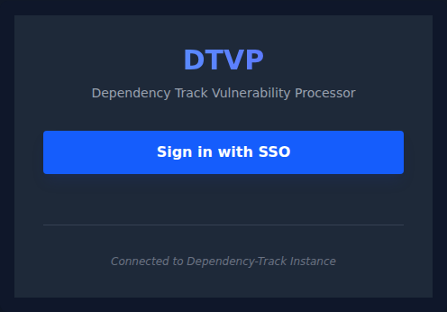
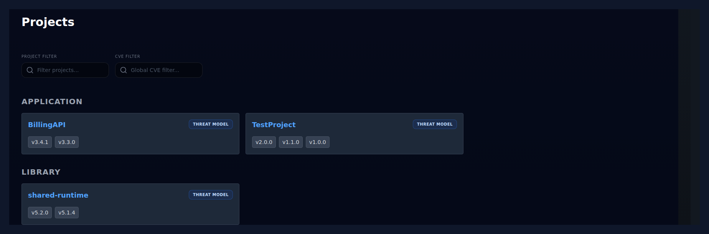
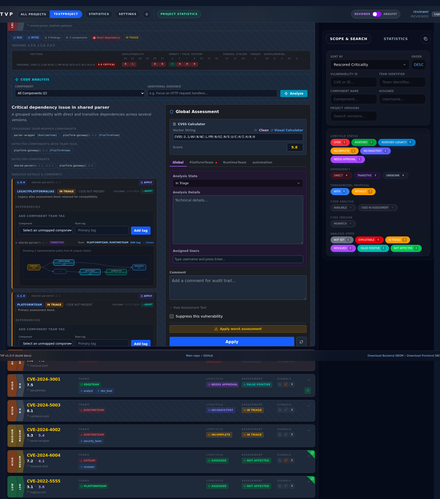
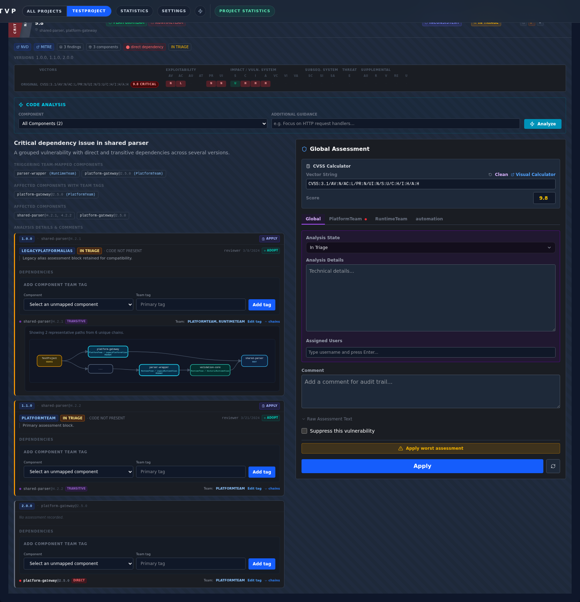
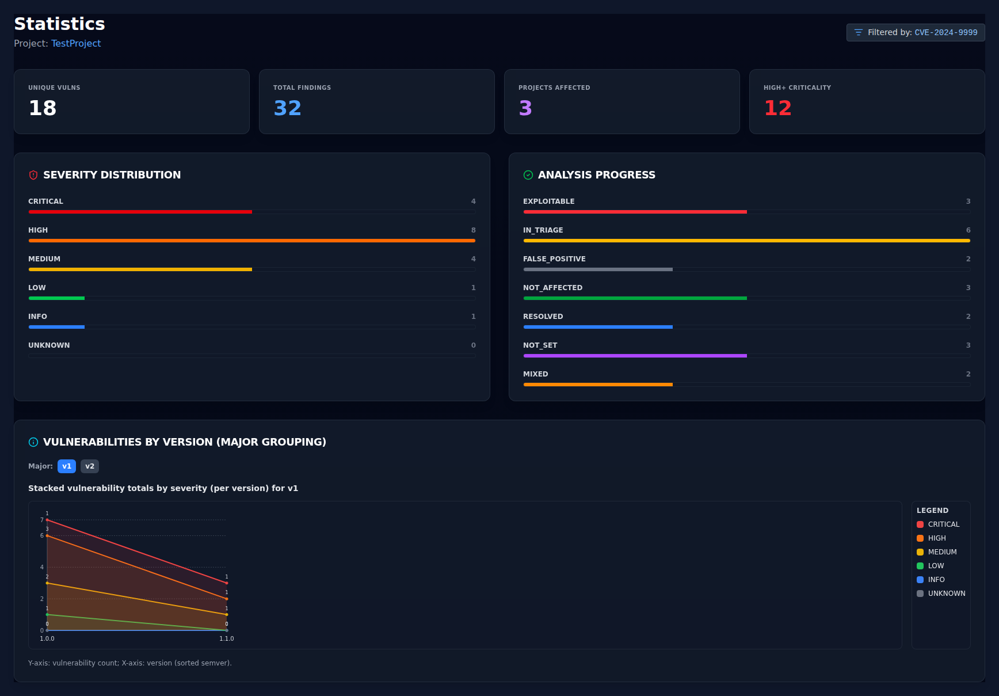
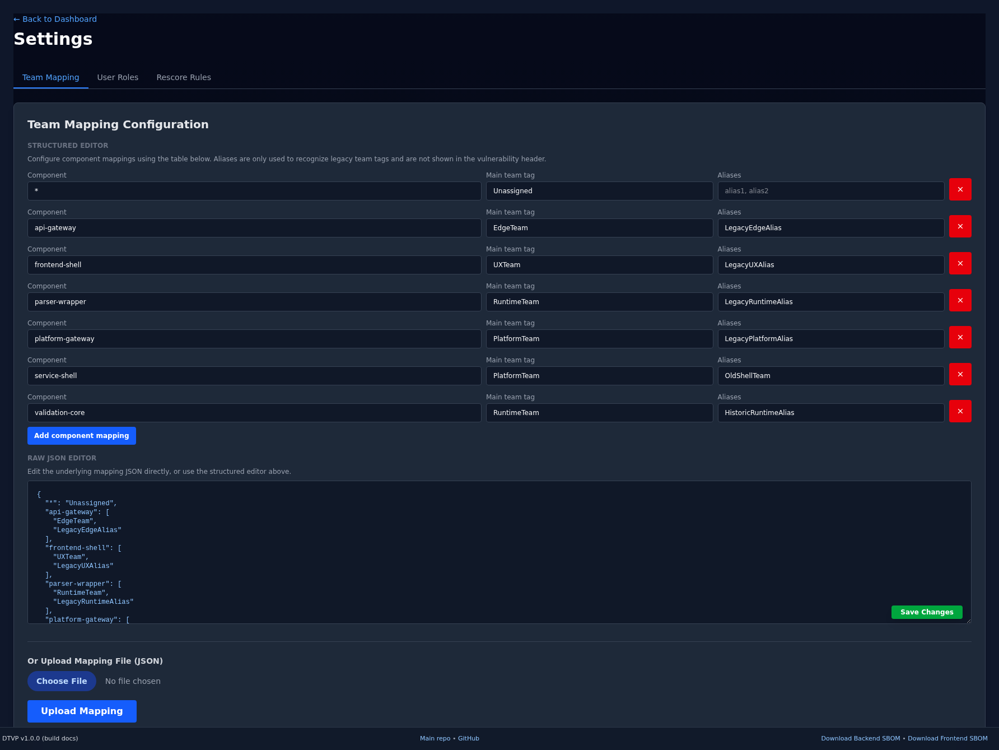

# Dependency Track Vulnerability Processor (DTVP)

DTVP is a FastAPI and Vue application for reviewing Dependency-Track findings across all versions of a project. It groups vulnerabilities by CVE, surfaces version-by-version differences in one place, and lets teams apply assessments in bulk instead of repeating the same work on every release.

The repository also includes a mock Dependency-Track service, which makes it possible to run the full application locally without a live upstream instance.

Repository links:

- Main repo: https://git.baer.one/phbaer/dtvp/
- GitHub mirror: https://github.com/phbaer/dtvp/

SBOM

- The container includes a CycloneDX SBOM at `/sbom/dtvp-cyclonedx.json`.
- Generated via `syft` (standard SBOM tooling) during Docker image build. 
- The app exposes it at `/api/sbom` and `/api/sbom/html`; footer includes "Download CycloneDX SBOM".
- Includes production frontend (`frontend/package.json`/`frontend/package-lock.json`) and backend (`pyproject.toml`/`uv.lock`) dependency components; test/dev dependencies excluded by design.

## What It Does

- Group the same vulnerability across multiple project versions.
- Show lifecycle states such as open, assessed, incomplete, inconsistent, and needs approval.
- Support global and team-specific assessments.
- Rescore findings with CVSS data and review the aggregated result in the UI.
- Edit team mappings, user roles, and rescore rules from the settings screen.
- Run against either a live Dependency-Track server or the bundled mock service.

## Threat-Model Rescoring

DTVP can optionally call an external tmrescore service to re-score vulnerabilities against a Microsoft Threat Modeling Tool export.

- Configure the backend with `DTVP_TMRESCORE_URL` to enable the UI entry points.
- Optionally set `DTVP_TMRESCORE_CACHE_PATH` to control where the latest per-project proposal snapshots are stored. By default DTVP writes them to `data/tmrescore_proposals.json`.
- Open a project and use the `Threat Model` action from the dashboard or project view.
- Upload the current `.tm7` file and optional `items.csv` / analysis config inputs.
- If an LLM backend is configured for tmrescore, you can enable `LLM enrichment` in the Threat Model UI and optionally choose the model used for threat-justification enrichment.
- After a successful run, the latest cached proposal set for that project is available directly inside each reviewer rescoring dialog where the vulnerability ID matches.
- Returning to the project view after a run triggers an immediate proposal refresh so the rescoring dialog can use the new suggestions without waiting for a backend restart or a manual reload.

SBOM strategy matters here:

- `Latest only` is a clean single-version snapshot and uses only the newest project version.
- `Merged multi-version SBOM` is the recommended mode for DTVP because it creates an analysis-only synthetic CycloneDX document with separate roots per version, preserving historical findings without pretending they all belong to the latest inventory.
- DTVP intentionally does not combine the latest SBOM with vulnerabilities found only in older versions, because that would attach findings to components that may not exist in the latest release.

## Stack

- Backend: Python 3.13+, FastAPI, Uvicorn, httpx
- Frontend: Vue 3, Vite, Tailwind CSS
- Python package manager: uv
- Frontend package manager: npm
- Local process manager: pm2
- Container runtime: Docker / Docker Compose

## Prerequisites

Install the following first:

- Python 3.13+
- Node.js 22+
- uv
- npm
- pm2
- Docker and Docker Compose if you want the container-based deployment path

## Install Dependencies

From the repository root:

```bash
uv sync --dev
cd frontend
npm ci
cd ..
```

## Local Mock Workflow With pm2

This is the simplest way to test the full application locally. It starts:

- `mock-dt` on `http://localhost:8081`
- `mock-tmrescore` on `http://localhost:8090`
- `dtvp-backend` on `http://localhost:8000`
- `dtvp-frontend` on `http://localhost:5173`

The process definitions live in `ecosystem.config.js`.

### Start The Full Local Stack

```bash
pm2 start ecosystem.config.js --update-env
```

Then open:

- Frontend: `http://localhost:5173`
- Backend API version endpoint: `http://localhost:8000/api/version`
- Mock Dependency-Track service: `http://localhost:8081`
- Mock TMRescore service: `http://localhost:8090/ui`

### Sign In To The Mock Stack

1. Open `http://localhost:5173/login`.
2. Click `Sign in with SSO`.
3. The mock Dependency-Track login page opens on port `8081`.
4. Choose `Login as Reviewer` to access the full UI, including Settings.
5. After the redirect back to DTVP, start browsing projects.

### Useful pm2 Commands

Check status:

```bash
pm2 list
```

Tail logs for all services:

```bash
pm2 logs
```

Tail one service only:

```bash
pm2 logs mock-dt
pm2 logs mock-tmrescore
pm2 logs dtvp-backend
pm2 logs dtvp-frontend
```

Stop and remove the local stack:

```bash
pm2 delete mock-dt mock-tmrescore dtvp-backend dtvp-frontend
```

## Manual Development Workflow

If you want to iterate on the backend or frontend manually while keeping the mock services managed by pm2, use this split workflow.

### 1. Start Only The Mock Services

```bash
pm2 start ecosystem.config.js --only mock-dt,mock-tmrescore
```

### 2. Start The Backend

Use the mock service values directly in your shell:

```bash
export DTVP_DT_API_URL=http://127.0.0.1:8081
export DTVP_DT_API_KEY=mock_key
export DTVP_OIDC_AUTHORITY=http://127.0.0.1:8081
export DTVP_OIDC_CLIENT_ID=mock_id
export DTVP_OIDC_CLIENT_SECRET=mock_secret
export DTVP_OIDC_REDIRECT_URI=http://localhost:5173/auth/callback
export DTVP_FRONTEND_URL=http://localhost:5173
export DTVP_TMRESCORE_URL=http://127.0.0.1:8090
export DTVP_VERSION_FETCH_CONCURRENCY=4
uv run uvicorn main:app --reload --host 127.0.0.1 --port 8000
```

If you want to skip the mock OIDC login entirely during local backend work, set this before starting Uvicorn:

```bash
export DTVP_DEV_DISABLE_AUTH=true
```

In that mode, `/auth/me` resolves to `devuser`, which is mapped to the `REVIEWER` role in `data/user_roles.json`.

### 3. Start The Frontend

In a separate terminal:

```bash
cd frontend
npm run dev
```

### 4. Stop The Mock Service

```bash
pm2 delete mock-dt mock-tmrescore
```

## Minimal Two-Mock Container Workflow

If you only want the lightweight mock services without the full pm2 stack, use the container wrappers in `test_setup`:

```bash
cd test_setup
docker compose up
```

This starts:

- mock Dependency-Track on `http://localhost:8081`
- mock tmrescore on `http://localhost:8090/ui`

Point DTVP at them with:

```bash
export DTVP_DT_API_URL=http://127.0.0.1:8081
export DTVP_DT_API_KEY=mock_key
export DTVP_TMRESCORE_URL=http://127.0.0.1:8090
```

## Application Walkthrough

The screenshots below were captured from the bundled mock stack started with `pm2 start ecosystem.config.js --update-env`.

### 1. Login

Start at the DTVP login page and hand off to the mock SSO provider.



### 2. Dashboard

The dashboard groups projects by classifier and shows all known versions of a project on a single card. Use the project filter to narrow the list and the global CVE filter to carry a CVE directly into the project view.



### 3. Project Vulnerability View

Selecting a project opens the grouped vulnerability view. This is the core workflow: filter by lifecycle and analysis state, inspect team markers, expand a CVE, review the aggregated history, and apply a synchronized assessment.

Recent UI updates reflected in this screenshot:
- lifecycle and analysis badges now recalculate against the currently filtered dependency/version/search result set instead of showing only overall totals
- direct/transitive dependency chain rendering now hides the vulnerable endpoint component in each chain for reduced redundancy
- long chain lists are capped at three items with a “show more” link to expand full chain list for the group
- team mapping now resolves aliases to the primary configured team name for consistency across lifecycle badges and assessment blocks



### 3.1. Dependency Chain Detail

The dependency section groups paths by direct dependency, shows only the primary configured team name for mapped components, and lets you expand longer path lists without repeating the vulnerable endpoint component itself.



### 4. Statistics

The statistics screen summarizes the same project data into totals, severity distribution, analysis progress, and per-major-version charts.



### 5. Settings

Reviewer users can edit team mappings, user roles, and rescore rules directly from the settings page.



## Running Tests

### Backend

```bash
uv run pytest
```

### Frontend Unit Tests

```bash
cd frontend
npm run test:unit -- --run
```

### Frontend End-To-End Tests

The UI tests expect the local stack to be available.

```bash
pm2 start ecosystem.config.js --update-env
cd frontend
npm run test:ui
```

To run only the real-stack threat-model Playwright flow against the pm2 mocks, use:

```bash
pm2 start ecosystem.config.js --update-env
cd frontend
DTVP_E2E_REAL_STACK=true npm run test:ui -- --grep "Threat-Model UI Flow"
```

## Docker Deployment

Use this when you want to run the packaged application instead of the local dev stack.

### 1. Create The Environment File

```bash
cp .env.dist .env
```

Fill in the real Dependency-Track and OIDC values.

### 2. Start The Container

```bash
cp compose.yml.dist compose.yml
docker compose up -d
```

The image mounts `./data` into the container so local mapping and rule files persist.

### Optional: Start The Mock TMRescore In Compose

If you want to test the threat-model integration in a containerized setup, enable the optional mock profile and point the backend at the mock service inside the Compose network.

Add this to `.env`:

```bash
DTVP_TMRESCORE_URL=http://mock-tmrescore:8090
```

Then start with the mock profile enabled:

```bash
cp compose.yml.dist compose.yml
docker compose --profile mock up -d
```

The mock tmrescore UI is then available on `http://localhost:8090/ui`.

## Environment Variables

| Variable | Description | Default |
| :--- | :--- | :--- |
| `DTVP_DT_API_URL` | Base URL of the Dependency-Track API | `http://localhost:8081` |
| `DTVP_DT_API_KEY` | Dependency-Track API key | `change_me` |
| `DTVP_TMRESCORE_URL` | Base URL of the external or mock tmrescore service | unset |
| `DTVP_TMRESCORE_TIMEOUT_SECONDS` | HTTP timeout for tmrescore API calls before DTVP falls back to polling `/progress` | `180` |
| `DTVP_TMRESCORE_CACHE_PATH` | Path to the cached per-project tmrescore proposal snapshot file | `data/tmrescore_proposals.json` |
| `DTVP_TMRESCORE_OLLAMA_MODEL` | Default Ollama model preselected for LLM enrichment in the threat-model UI | `qwen2.5:7b` |
| `DTVP_TMRESCORE_TASK_TTL_SECONDS` | How long completed or failed tmrescore analysis tasks stay in DTVP memory for `/progress` polling | `3600` |
| `DTVP_OIDC_AUTHORITY` | OIDC authority URL | unset |
| `DTVP_OIDC_CLIENT_ID` | OIDC client ID | unset |
| `DTVP_OIDC_CLIENT_SECRET` | OIDC client secret | unset |
| `DTVP_OIDC_REDIRECT_URI` | OIDC callback URL | derived from frontend URL and context path |
| `DTVP_FRONTEND_URL` | Frontend base URL | `http://localhost:8000` |
| `DTVP_CONTEXT_PATH` | Application mount path | `/` |
| `DTVP_SESSION_SECRET_KEY` | Session signing key | `change_me` |
| `DTVP_DEFAULT_PROJECT_FILTER` | Default project filter shown on the dashboard | empty |
| `DTVP_VERSION_FETCH_CONCURRENCY` | Max number of project versions fetched in parallel when building grouped views and statistics | `4` |
| `DTVP_DEV_DISABLE_AUTH` | Disable OIDC and force the backend to return `devuser` locally | `false` |
| `DTVP_BUILD_COMMIT` | Build metadata shown in the UI | `unknown` |

## License

This project is licensed under the MIT License. See [LICENSE](LICENSE).
