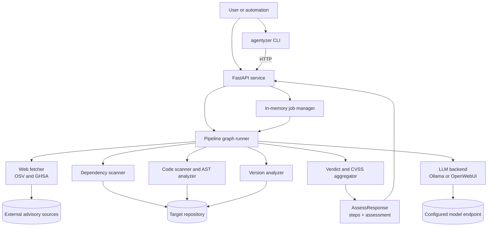

# Agentic Vulnerability Analyzer

Agentyzer is a FastAPI service and companion CLI for determining whether a repository or component is actually affected by a CVE or GHSA. It combines advisory retrieval, dependency and version inspection, source scanning, LLM-assisted reachability analysis, and verdict aggregation into a single assessment pipeline.

## Executive Summary

Agentyzer answers a narrower and more useful question than "is this dependency listed in an advisory?" The system tries to determine whether the target codebase is affected in practice by combining:

- Advisory data from OSV and GHSA.
- Dependency and lock-file presence checks.
- Version-range matching against the advisory.
- AST and text-based code scanning for vulnerable symbols and imports.
- LLM-assisted reachability and exploitability analysis.
- Final verdicting with CVSS rescoring and Dependency-Track compatible fields.

The service supports synchronous assessments for direct integrations and asynchronous job execution for UI or automation flows that need progress tracking. The CLI is a thin client over the API and can submit, poll, print, and clean up jobs.

## Quick Reference

Start the API:

```bash
export AGENTYZER_ENVIRONMENT=development
export AGENTYZER_SERVICE_TOKEN="$(openssl rand -hex 32)"
uv run uvicorn src.main:app --host 0.0.0.0 --port 8000
```

Check service health:

```bash
curl -H "Authorization: Bearer $AGENTYZER_SERVICE_TOKEN" \
  -H "X-Agentyzer-Owner: cli" http://localhost:8000/health
uv run agentyzer health
```

Submit a synchronous assessment:

```bash
uv run agentyzer assess --component benchmark --vuln CVE-2024-49766 --sync
```

Submit an async assessment and inspect it later:

```bash
curl -X POST http://localhost:8000/assess \
  -H "Authorization: Bearer $AGENTYZER_SERVICE_TOKEN" \
  -H "X-Agentyzer-Owner: cli" \
  -H "Content-Type: application/json" \
  -d '{"component_name":"benchmark","vuln_id":"CVE-2024-49766"}'

uv run agentyzer jobs
uv run agentyzer result <job-id>
uv run agentyzer delete <job-id>
```

## What The System Does

Agentyzer exposes two operator surfaces:

- A FastAPI application that accepts assessment requests and returns either a finished result or an async job handle.
- A CLI named `agentyzer` that talks to the running API.

At startup the service:

1. Validates service authentication before exposing the API.
2. Loads and hot-reloads `config/repos.yaml` for component-to-repository mappings.
3. Validates the prompt bundles used by the LLM-assisted steps.
4. Constructs the configured LLM backend from environment variables.
5. Initializes an owner-scoped in-memory job store for async assessments.
6. Performs an LLM health check and logs whether model-backed steps are available.

## End-To-End Process

### Process tree

```text
Assessment request
├── Entry surface
│   ├── CLI: agentyzer assess
│   └── API: POST /assess
├── Execution mode
│   ├── sync=true
│   │   └── Run pipeline inline and return AssessResponse
│   └── sync=false
│       ├── Create in-memory job record
│       ├── Run pipeline in background task
│       ├── Poll GET /jobs/{job_id}
│       ├── Fetch GET /jobs/{job_id}/result
│       └── Cleanup DELETE /jobs/{job_id}
└── Pipeline
    ├── discover_vuln
    ├── fetch_advisory
    ├── filter_advisory
    ├── prepare_repo
    ├── parallel branch A
    │   ├── scan_dependencies
    │   ├── analyze_versions
    │   └── what_if_remediation
    ├── parallel branch B
    │   ├── scan_code
    │   ├── llm_analyze_code
    │   └── llm_deep_analyze
    ├── check_transitive_paths
    └── aggregate_verdict
```

### Architecture diagram



### Pipeline steps in detail

The implemented step order is defined in `src/pipeline/graph.py` and runs as follows:

1. `discover_vuln`: if the caller did not provide a vulnerability ID, query OSV for known vulnerabilities for the component and select the highest-severity candidate.
2. `fetch_advisory`: fetch advisory details, affected packages, affected ranges, vulnerable symbols, and summary text.
3. `filter_advisory`: determine whether the advisory is relevant to the assessed component before spending time on deeper analysis.
4. `prepare_repo`: resolve the configured repository or local focus path and prepare the checkout for scanning.
5. `scan_dependencies`: inspect manifests and lock files for direct or transitive presence of the vulnerable package.
6. `scan_code`: search the repository for imports, symbol usage, and vulnerable API references.
7. `llm_analyze_code`: send code snippets and surrounding context to the LLM to estimate reachability.
8. `llm_deep_analyze`: perform a deeper LLM pass over the relevant code neighborhood to judge exploitability more carefully.
9. `analyze_versions`: compare discovered versions against the advisory's explicit versions and normalized version ranges.
10. `what_if_remediation`: compute candidate upgrade or mitigation directions based on the detected version state.
11. `check_transitive_paths`: analyze dependency chains and intermediary packages for transitive exposure.
12. `aggregate_verdict`: merge all evidence into the final assessment, including summary, reasoning, remediation, audit view, and CVSS adjustments.

If `filter_advisory` concludes the advisory is not relevant, the pipeline can short-circuit directly to verdict aggregation.

### Decision algorithm

The pipeline above is the execution order. The actual assessment algorithm is the evidence reduction logic that turns those step outputs into one verdict.

In simplified form, Agentyzer does this:

1. Normalize the advisory.
   Extract affected packages, affected version ranges, explicit affected versions, vulnerable symbols, and CVSS data from OSV, GHSA, and supplemental sources.

2. Confirm dependency presence.
   Scan manifests and lock files to determine whether the vulnerable package is present directly, transitively, only via SBOM attribution, or not rediscovered locally.

3. Inventory versions across the repo history.
   Collect the vulnerable package version from the current workspace, lock files, tags, and release branches.
   When callers provide `affected_product_versions` (for example, DTVP's affected project versions), Agentyzer tries to match each product version to exact or release-style tags/branches such as `v1.2.3`, `1.2.3`, `release/1.2.3`, or `release/1.2`; tag matching treats the leading `v` as optional. Unmatched product versions are kept as explicit `not found` rows in `version_analysis.checked_versions`.

4. Apply worst-case version matching.
   Compare every discovered version against the advisory ranges.
   If any tracked version is affected, the component is treated as version-affected overall.
   This is intentionally conservative: a patched workspace does not erase the fact that historical shipped releases were vulnerable.

5. Run code and reachability analysis on the current workspace only.
   Source scanning, LLM reachability analysis, deep exploitability review, and transitive call-path analysis are all workspace-scoped.
   The system does not attempt historical code reachability analysis for old tags or release branches.

6. Combine version evidence with workspace reachability.
   This is the key rule set:

  - If the current workspace version is affected and the vulnerable functionality is reachable or plausibly reachable, the result stays in the affected bucket.
  - If only historical versions are affected, that still keeps the component in scope by default.
  - If only historical versions are affected but the current workspace analysis affirmatively excludes the vulnerable functionality, that workspace reachability evidence can overrule the historical version inclusion and produce `Not Affected` for the current assessment.
  - If historical versions are affected and the current workspace does not provide affirmative exclusion evidence, the result remains `Probably Affected` rather than `Not Affected`.

7. Apply contradiction safeguards.
   The final verdict logic cross-checks the LLM verdict against hard evidence. For example, a `Not Affected` verdict is overridden when reachable code or exploitability evidence contradicts it. Conversely, a historical-only affected result can remain `Not Affected` only when the workspace evidence clearly excludes runtime exploitability.

8. Rescore CVSS and format the final response.
   Once the final verdict is stable, Agentyzer rescales the advisory CVSS vector to reflect the assessed environment and emits a structured response with the verdict, reasoning, audit view, remediation hints, and Dependency-Track compatible fields.

The practical interpretation is:

- Version analysis answers: did any tracked release ship an affected version?
- Reachability analysis answers: is the affected functionality reachable in the current workspace?
- Final verdict answers: given both of those facts, is the assessed codebase affected now?

That separation is deliberate. Historical version evidence widens the set of potentially affected releases, while workspace reachability evidence is the only basis for clearing the current assessment when the workspace itself is patched.

## Repository Layout

```text
.
├── config/
│   ├── repos.yaml
│   └── prompts/
├── docker-compose.yml
├── Dockerfile
├── Jenkinsfile
├── pyproject.toml
├── repos/
│   └── ... cached or sample repositories used during analysis
├── src/
│   ├── cli.py
│   ├── http.py
│   ├── main.py
│   ├── agents/
│   ├── llm/
│   └── pipeline/
└── tests/
```

The main code responsibilities are:

- `src/main.py`: FastAPI application, request and response models, async job orchestration, startup lifecycle.
- `src/cli.py`: command-line client for health checks, assessment submission, polling, result rendering, and job cleanup.
- `src/http.py`: shared HTTP client helper that trusts the system CA store.
- `src/agents/`: dependency scanning, AST analysis, code scanning, web fetch, version analysis, CVSS rescoring, and verdict logic.
- `src/llm/`: backend abstraction plus Ollama and OpenWebUI clients.
- `src/pipeline/`: graph topology, state contract, and step nodes.

## Requirements

- Python 3.14+
- `uv`
- Git
- One reachable LLM backend:
  - Ollama
  - OpenWebUI-compatible endpoint

## Installation And Local Development

### Install dependencies

```bash
uv sync
```

### Configure the LLM backend

Ollama is the default backend:

```bash
ollama serve
ollama pull mistral
```

To use OpenWebUI instead, set the environment variables described below.

### Run the API server

```bash
uv run uvicorn src.main:app --host 0.0.0.0 --port 8000
```

The API will be available at `http://localhost:8000`.

### Run the CLI against the local server

```bash
uv run agentyzer health
uv run agentyzer assess --component benchmark --vuln CVE-2024-49766 --sync
```

## Configuration

### Environment variables

| Variable | Default | Purpose |
|---|---|---|
| `LLM_BACKEND` | `ollama` | Selects the LLM backend: `ollama` or `openwebui`. |
| `OLLAMA_HOST` | `http://localhost:11434` | Base URL for Ollama. |
| `OLLAMA_MODEL` | `mistral` | Model name used with Ollama. |
| `OPENWEBUI_HOST` | `http://localhost:3000` | Base URL for OpenWebUI. |
| `OPENWEBUI_MODEL` | `mistral` | Model identifier served by OpenWebUI. |
| `OPENWEBUI_API_KEY` | empty | Bearer token for OpenWebUI when required. |
| `OPENWEBUI_TOOL_CALLS` | `auto` | Native OpenAI-style research tool calls for OpenWebUI, or `off` to use text `FETCH_*` only. |
| `OPENWEBUI_CONTEXT_WINDOW` | `0` | Optional model context window in tokens. When set, Agentyzer pre-trims oversized OpenWebUI prompts before sending them. |
| `OPENWEBUI_CONTEXT_SAFETY_MARGIN` | `256` | Token margin reserved below the configured or reported context limit. |
| `OPENWEBUI_CONTEXT_RETRIES` | `2` | Number of retries after OpenWebUI rejects a request for exceeding context length. |
| `OPENWEBUI_MIN_COMPLETION_TOKENS` | `256` | Minimum completion budget to preserve when truncating input context. |
| `LOG_LEVEL` | `INFO` | Standard Python logging level. |
| `AGENTYZER_CONFIG_DIR` | `config` | Alternate config directory containing `repos.yaml` and prompts. |
| `AGENTYZER_REPOS_DIR` | `repos` | Base directory for cached or reused repository workspaces. |
| `AGENTYZER_MAX_CONCURRENT_JOBS` | `1` | Maximum number of async or sync assessment pipelines allowed to execute at the same time. Extra async jobs remain `pending` until a slot opens. |
| `AGENTYZER_ENVIRONMENT` | `production` | Security profile: `production`, `development`, or `test`. |
| `AGENTYZER_SERVICE_TOKEN` | unset | Bearer token required by every HTTP route; use at least 32 characters. |
| `AGENTYZER_SERVICE_TOKEN_FILE` | unset | File containing the bearer token when the direct value is unset. |
| `AGENTYZER_ADMIN_TOKEN` | unset | Separate bearer token required for the service-wide `*` owner scope; use at least 32 characters and never reuse the service token. |
| `AGENTYZER_ADMIN_TOKEN_FILE` | unset | File containing the admin token when the direct value is unset. |
| `AGENTYZER_ALLOW_UNAUTHENTICATED` | `false` | Explicit bypass for local development/test only; production rejects it. |
| `AGENTYZER_ALLOW_EXTERNAL_FOCUS_PATH` | `false` | Permit local checkout paths outside `AGENTYZER_REPOS_DIR` in development/test only; production rejects it. |
| `AGENTYZER_CALLER_OWNER` | `cli` | Owner header used by the CLI to isolate its jobs. |

### Component registry

`config/repos.yaml` maps logical component names to repositories. Those names are what the API and CLI accept as `component_name` or `--component` values.

Example:

```yaml
components:
  benchmark:
    url: "https://git.example.com/org/benchmark.git"
    clone: true
    auth:
      type: basic
      username: "user"
      password: "token"
```

Notes:

- If `focus_path` is provided, the analyzer can work against an existing local checkout instead of cloning.
- The service reloads `config/repos.yaml` when the file modification time changes.

## API Capabilities

The API is designed for two integration styles:

- Direct request-response integrations that want a finished assessment immediately.
- Job-oriented integrations that want polling, progress updates, and deferred result retrieval.

Every API route, including health, configuration, prompt inspection, and
OpenAPI, requires bearer authentication. Callers also send
`X-Agentyzer-Owner`; job operations return `404` for another owner's job so
identifiers do not become an existence oracle. The normal service credential
cannot request the `*` owner. The trusted DTVP backend uses the separate admin
credential only for reviewer-wide operational status. The CLI reads the normal
token from `AGENTYZER_SERVICE_TOKEN` or `--token-file`; `--owner '*'` instead
uses `AGENTYZER_ADMIN_TOKEN` or `--admin-token-file`.

### OpenAPI and interactive documentation

| Endpoint | Purpose |
|---|---|
| `GET /openapi.json` | Authenticated raw OpenAPI document. Interactive docs are disabled to avoid an unauthenticated schema surface. |

### API endpoints

| Method | Path | Purpose |
|---|---|---|
| `GET` | `/health` | Liveness check for the API process. |
| `GET` | `/configuration` | Sanitized service configuration and backend information for consumers. |
| `GET` | `/prompts` | Prompt bundle metadata; pass `include_values=true` to include configured prompt text. |
| `POST` | `/assess` | Submit an assessment request, synchronously or asynchronously. |
| `POST` | `/benchmark/compare` | Probabilistically compare a human assessment artifact with an automated assessment result. |
| `GET` | `/jobs` | List the caller owner's in-memory async jobs. |
| `GET` | `/jobs/{job_id}` | Fetch job status and progress. |
| `GET` | `/jobs/{job_id}/result` | Retrieve the final assessment for a completed job. |
| `POST` | `/jobs/{job_id}/compact` | Build concise structured context from a completed job. |
| `POST` | `/jobs/{job_id}/follow-up` | Start another assessment using the compacted parent job context plus a reviewer question. |
| `DELETE` | `/jobs/{job_id}` | Cancel a pending/running job or remove a completed/failed/cancelled job from memory. |

### Assessment request fields

| Field | Type | Required | Meaning |
|---|---|---|---|
| `component_name` | string | Yes | Logical component name from `config/repos.yaml`, or an ad-hoc label when `focus_path` is used. |
| `vuln_id` | string | No | CVE or GHSA to assess. If omitted, the service attempts discovery. |
| `cvss_vector` | string | No | Override or supply the base CVSS vector for rescoring. |
| `focus_path` | string | No | Absolute path to a local checkout that should be analyzed instead of a configured repo. |
| `dependency_paths` | `string[][]` | No | Dependency chains used to bias transitive reachability analysis. |
| `user_guidance` | string | No | Analyst context passed to every LLM-backed step. |
| `model` | string | No | Optional per-assessment LLM model override when the configured backend supports it. |
| `llm_backend` | string | No | Optional caller-supplied backend label for tracking. |
| `llm_provider` | string | No | Optional caller-supplied provider label for tracking. |
| `debug` | boolean | No | Include more detailed per-step inputs and traces in the result. |

### Benchmark comparisons

`POST /benchmark/compare` evaluates assessment artifacts only. It does not
clone repositories, inspect dependency files, or rerun source analysis. DTVP
uses it after a normal Agentyzer assessment has produced an automated result.

The request body contains a `benchmark` object prepared by DTVP with:

- the current human assessment snapshot
- the saved automated assessment summary
- deterministic state, justification, and CVSS deltas
- a fallback 1-5 rating; any letter grade is a derived display alias

Agentyzer asks the configured LLM to judge the free-text reasoning and evidence
semantically, using the deterministic deltas as anchors. The response keeps the
same benchmark shape and adds evaluator metadata, `comparison_method`, findings,
recommendation, and an optional reasoning summary. If the LLM backend is not
healthy or returns invalid JSON, Agentyzer returns a deterministic fallback
instead of rerunning source analysis.

The benchmark judge prompt is loaded from
`config/prompts/benchmark_comparison.yaml`, or from a matching override under
`AGENTYZER_CONFIG_DIR/prompts`. The numeric `rating.score` is canonical; a
`rating.grade` value is retained only as a score-derived display alias.

### Service configuration and backend information

`GET /health`, `GET /configuration`, async submission responses, and job status responses include operational metadata for consumers:

- `configuration`: sanitized service configuration, including service name/version, config paths, repository workspace directory, configured component names/counts, alias names, and enabled interface features.
- `backend`: runtime backend details, including LLM provider/client/model/health, repository workspace reuse behavior, and in-memory job-store counts.
- `model`, `llm_backend`, `llm_provider`, and `llm`: compatibility fields with the configured or accepted LLM backend metadata.

The configuration payload is intentionally sanitized. It does not return repository credentials, authenticated clone URLs, or raw component auth blocks from `repos.yaml`.

### Assessment response capabilities

`AssessResponse` contains two top-level sections:

- `assessment`: the final verdict, confidence, exposure, reasoning, CVSS output, Dependency-Track compatible fields, and optional researcher, remediation, audit, advisory relevance, and version-analysis views.
- `steps`: ordered pipeline step findings with structured findings plus evidence strings.

Important assessment payload capabilities:

- Verdict classification through `affected`, `verdict`, `confidence`, and `exposure`.
- Advisory filtering output through `advisory_relevance`.
- Version matching evidence through `version_analysis`.
- Human-targeted reporting through `summary` and `reasoning`.
- Machine-consumable Dependency-Track style fields through `analysis`, `justification`, `response`, `cvss_vector`, and `cvss_score`.
- CVSS adjustment explanation through `adjusted_cvss`, including comparison traces and reasons.

### Async job capabilities

Async jobs are held in memory inside the FastAPI process. That means:

- Job state is not durable across process restarts.
- `GET /jobs` only returns jobs owned by the caller identity in the current API instance.
- `GET /jobs` returns shared `configuration` and `backend` metadata once on the response envelope; individual jobs carry job-specific request, progress, log, and LLM metadata.
- `DELETE /jobs/{job_id}` cancels a `pending` or `running` job, and removes a finished job from memory.
- `POST /jobs/{job_id}/compact` extracts bounded request, verdict, CVSS, evidence, and step-finding context from a completed job so clients can reuse it without replaying the full result.
- `POST /jobs/{job_id}/follow-up` creates a new async job from that compact context and an analyst question. DTVP uses this path for follow-up vulnerability assessment questions. The rendered compact context is capped before it is embedded into model guidance.
- `AGENTYZER_MAX_CONCURRENT_JOBS` bounds how many pipelines run at once. The default is `1`, matching the usual single-LLM-backend deployment. Raise it only when the configured model backend and repository workspace strategy can handle parallel scans.

Job status responses include:

- Lifecycle state: `pending`, `running`, `completed`, `failed`, or `cancelled`.
- Timestamps for creation and completion.
- Progress metrics: completed steps, total steps, percent complete.
- Current step, agent, and activity labels.
- Parallel branch visibility through `active_agents` and `step_statuses`.
- Recent live log entries in `logs`, plus request metadata and LLM metadata (`model`, `llm_backend`, `llm_provider`, `llm`) when known. Single-job status responses also include service configuration and backend information.

### API usage examples

The commands in this section were smoke-tested against a local instance on 2026-05-02. Health, OpenAPI, async submission, job polling, result retrieval, CLI health, CLI job listing, CLI result retrieval, and CLI deletion all completed successfully.

Health check:

```bash
curl \
  -H "Authorization: Bearer $AGENTYZER_SERVICE_TOKEN" \
  -H "X-Agentyzer-Owner: local-cli" \
  http://localhost:8000/health
```

Service configuration:

```bash
curl \
  -H "Authorization: Bearer $AGENTYZER_SERVICE_TOKEN" \
  -H "X-Agentyzer-Owner: local-cli" \
  http://localhost:8000/configuration
```

Representative service configuration excerpt:

```json
{
  "status": "ok",
  "model": "mistral",
  "llm_provider": "ollama",
  "configuration": {
    "service_version": "0.1.0",
    "config_dir": "config",
    "repos_config_path": "config/repos.yaml",
    "repositories": {
      "workspace_dir": "repos",
      "component_count": 4,
      "components": ["benchmark", "web"],
      "hot_reload": true
    }
  },
  "backend": {
    "llm": {
      "provider": "ollama",
      "backend": "OllamaClient",
      "host": "http://localhost:11434",
      "model": "mistral",
      "healthy": true
    },
    "repositories": {
      "reuse_strategy": "stable directory per sanitized repository URL using the repo name and a SHA-256 URL hash"
    },
    "jobs": {
      "job_store": "in_memory",
      "known_jobs": 0
    }
  }
}
```

Synchronous assessment:

```bash
curl -X POST "http://localhost:8000/assess?sync=true" \
  -H "Content-Type: application/json" \
  -d '{
    "component_name": "benchmark",
    "vuln_id": "CVE-2024-49766",
    "debug": true,
    "user_guidance": "Prioritize HTTP-reachable paths"
  }'
```

Asynchronous assessment:

```bash
curl -X POST "http://localhost:8000/assess" \
  -H "Content-Type: application/json" \
  -d '{
    "component_name": "benchmark",
    "vuln_id": "CVE-2024-49766"
  }'

curl http://localhost:8000/jobs/<job-id>
curl http://localhost:8000/jobs/<job-id>/result
curl -X DELETE http://localhost:8000/jobs/<job-id>
```

Local checkout assessment:

```bash
curl -X POST "http://localhost:8000/assess?sync=true" \
  -H "Content-Type: application/json" \
  -d '{
    "component_name": "benchmark",
    "vuln_id": "CVE-2024-49766",
    "focus_path": "/path/to/local/repo"
  }'
```

Representative async submission response excerpt:

```json
{
  "job_id": "9b05cd2dbd0b",
  "status": "pending",
  "poll_url": "/jobs/9b05cd2dbd0b"
}
```

Representative completed result excerpt:

```json
{
  "assessment": {
    "affected": false,
    "verdict": "Not Affected",
    "confidence": "Low",
    "exposure": "transitive",
    "summary": "AUDIT FAILURE: the downgrade to Not Affected / low-info is not supported by the available evidence. Werkzeug safe_join not safe on Windows",
    "analysis": "NOT_AFFECTED",
    "justification": "CODE_NOT_REACHABLE",
    "cvss_score": 0.0
  },
  "steps": [
    {
      "step": "scan_dependencies",
      "title": "Dependency Scan",
      "status": "found"
    },
    {
      "step": "aggregate_verdict",
      "title": "Final Verdict",
      "status": "Not Affected"
    }
  ]
}
```

## CLI Capabilities

The CLI is defined in `src/cli.py` and wraps the API rather than running analysis locally.

The intended CLI operator loop is:

1. Point the CLI at a running API with `--url` when needed.
2. Submit an assessment.
3. Inspect live jobs or fetch a completed result.
4. Delete finished jobs when you no longer need them.

### Commands

| Command | Capability |
|---|---|
| `agentyzer health` | Check whether the API is reachable. |
| `agentyzer assess` | Submit a vulnerability assessment. |
| `agentyzer jobs` | List known async jobs. |
| `agentyzer result <job-id>` | Fetch the result for a completed job. |
| `agentyzer delete <job-id>` | Cancel a running async job or delete a finished one. |

### Global option

| Option | Meaning |
|---|---|
| `--url` | Base URL of the API server. Defaults to `http://localhost:8000`. |

### `assess` options

| Option | Meaning |
|---|---|
| `-c`, `--component` | Required component name. |
| `-v`, `--vuln` | Vulnerability ID such as `CVE-2024-49766`. |
| `--cvss-vector` | Explicit CVSS vector to use for rescoring. |
| `--focus-path` | Path that narrows the assessment to a local checkout. |
| `--guidance` | Additional analyst context for LLM steps. |
| `--sync` | Block until the assessment finishes. |
| `--debug` | Print verbose debug-oriented output and traces. |

### CLI examples

```bash
uv run agentyzer health

uv run agentyzer assess \
  --component benchmark \
  --vuln CVE-2024-49766 \
  --sync

uv run agentyzer assess \
  --component benchmark \
  --vuln CVE-2024-49766 \
  --guidance "Treat worker-triggered paths as in scope" \
  --debug

uv run agentyzer jobs
uv run agentyzer result <job-id>
uv run agentyzer delete <job-id>
```

The CLI formatter prints:

- Verdict, confidence, and exposure.
- Advisory relevance and version analysis summaries.
- CVSS original versus adjusted score plus reasons.
- Researcher, remediation, and audit views when present.
- Pipeline step evidence, including node input summaries when debug data is available.

Representative CLI result excerpt:

```text
✓ Not Affected  (confidence: Low, exposure: transitive)
  Advisory filter: relevant (rules)
  Version analysis: 3.1.6 (lock file, not affected)
  CVSS 4.0: 6.3 → 0.0

  Researcher view:
    summary: Research conclusion: Not Affected.

  Audit view:
    status: fail
    consistency: mixed
```

## Pipeline And Analysis Design

The pipeline state contract lives in `src/pipeline/state.py` and carries:

- Inputs such as `vuln_id`, `component_name`, `dependency_paths`, `user_guidance`, and `cvss_vector`.
- Intermediate artifacts such as advisories, dependency findings, snippets, LLM analysis, transitive analysis, and version inventory.
- Final output in `result`.
- Structured `step_reports` and append-only `evidence` for auditing.

The graph wiring in `src/pipeline/graph.py` also records step metadata such as title, agent name, and current activity. Those labels are surfaced in async job progress responses. LLM-bound stages emit model-wait heartbeat progress while the backend is waiting for OpenWebUI or Ollama, so API clients can distinguish slow model generation from a stalled job. With OpenWebUI and `OPENWEBUI_TOOL_CALLS=auto`, research-capable LLM calls advertise bounded OpenAI-style tools (`search_web`, `fetch_url`, `fetch_package`, `fetch_source`); Agentyzer executes them locally through its existing allowlisted handlers, records assistant tool calls plus returned `tool` messages in `llm_conversation`, and falls back to text `FETCH_*` directives when native tool calls are unavailable. The OpenWebUI backend retries one transient remote stream disconnect before reporting the model call as unavailable.

Arbitrary research URLs are restricted to public HTTPS destinations on the
default port. DNS must resolve entirely to globally routable addresses, every
redirect is revalidated, response types are limited to textual formats, and
only a bounded response prefix is read. In production, an assessment
`focus_path` must resolve inside `AGENTYZER_REPOS_DIR`; symlink escapes and
arbitrary host filesystem paths are rejected.

All LLM prompts are managed as YAML bundles in `config/prompts/`. Prompt bundles use compact `analysis_protocol` sections instead of bundled few-shot example transcripts. The protocol tells the model to keep analysis private, apply security researcher/remediator/auditor/ticket-author lenses internally, and emit only structured evidence fields such as call paths, dependency chains, exclusions, remediation, and validation notes. Response contracts define exact field order, allowed values, evidence labels, and disallow markdown, JSON, preambles, conclusions, or extra fields. Legacy custom prompt bundles that still provide `few_shot` are accepted as a compatibility alias for `analysis_protocol`.

OpenWebUI context limits are handled in two ways. If OpenWebUI rejects a request
with a context-length error, Agentyzer parses the reported model limit and input
token count, then retries with a lower completion budget or a compacted prompt.
For models with a known window, set `OPENWEBUI_CONTEXT_WINDOW` to enable
preflight prompt compaction before the request is sent. For example, a model
with a 131072-token context can use `OPENWEBUI_CONTEXT_WINDOW=131072`.

## Parallel Project Runs And Workspace Reuse

Multiple async jobs can be submitted to the FastAPI process. Accepted jobs are kept in the in-memory job store; at most `AGENTYZER_MAX_CONCURRENT_JOBS` pipelines run at the same time, and the rest stay `pending` until an execution slot opens. The default is `1` because DTVP's packaged deployment usually points Agentyzer at one LLM backend. Increase the value only when the model backend, CPU/disk resources, and repository workspace strategy can support parallel scans.

Inside one running pipeline, Agentyzer still exposes parallel branch visibility through `progress.active_agents` and `progress.step_statuses`; the pipeline graph can fan out into dependency/version and code/LLM branches after repository preparation.

Repository workspaces are already reused across runs. `src/agents/dependency_scanner.py` maps each repository URL to a stable directory under `AGENTYZER_REPOS_DIR` (default: `repos`) using the repo name plus a SHA-256 hash of the sanitized URL. That means repeated runs for the same configured repository use the same local workspace instead of cloning repeatedly.

For different projects, raising `AGENTYZER_MAX_CONCURRENT_JOBS` can be realistic with the current design:

- Different repository URLs map to different workspace directories.
- Clone/fetch work is offloaded to worker threads, so large Git operations do not block the event loop.
- The main shared bottlenecks are CPU/disk IO during scans and the configured LLM backend throughput.
- The global execution limit is process-local and applies before a pipeline starts. There is not yet a separate LLM-stage rate limiter.

For the same project or any two jobs that resolve to the same workspace, the current implementation is not fully parallel-safe. Existing workspaces are refreshed by updating the remote URL, fetching, and resetting the working tree to the remote default branch. If two jobs do that against the same directory at once, one run can reset, re-clone, or mutate files while the other run is scanning.

The recommended implementation path is:

1. Add a per-workspace async lock around clone/fetch/reset so only one job updates a given cached repository at a time.
2. After the update, analyze an isolated per-run checkout created with `git worktree add --detach` at the resolved commit, or another snapshot mechanism. This reuses the Git object database and avoids a full clone while keeping each scan's files stable.
3. Clean up per-run worktrees when the job is deleted or after a retention window.
4. Add optional per-LLM-stage semaphores or provider-specific rate limiting when a deployment needs more than one overall pipeline slot.

So, multiple parallel runs for different projects are feasible when capacity is raised deliberately; robust parallel runs sharing the same underlying repository need workspace locking plus per-run worktrees or snapshots to preserve reuse without repeated clones.

## Docker Setup

### Dockerfile behavior

The top-level `Dockerfile`:

1. Uses `ghcr.io/astral-sh/uv:python3.14-trixie-slim` as the base image.
2. Installs Git because repository cloning and tag inspection are required.
3. Optionally mounts a CA certificate secret at build time and installs it into the system trust store.
4. Installs locked production dependencies with `uv sync --frozen --no-dev`.
5. Copies `config/` and `src/` into `/app`.
6. Sets `PYTHONPATH=/app`, `AGENTYZER_CONFIG_DIR=/app/config`, and `AGENTYZER_REPOS_DIR=/app/repos`.
7. Exposes port `8000`.
8. Starts the service with `uv run --no-sync uvicorn src.main:app --host 0.0.0.0 --port 8000`.

Build example:

```bash
docker build -t agentyzer .
docker run --rm -p 127.0.0.1:8000:8000 \
  -e AGENTYZER_ENVIRONMENT=development \
  -e AGENTYZER_SERVICE_TOKEN="$AGENTYZER_SERVICE_TOKEN" \
  agentyzer
```

### Docker Compose behavior

`docker-compose.yml` defines one service named `analyzer` that:

- Builds from the local Dockerfile.
- Publishes container port `8000` on host loopback port `8000`.
- Mounts `./config` into `/app/config` as read-only.
- Points the containerized service at an Ollama instance via `OLLAMA_HOST=http://host.docker.internal:11434`.
- Defaults to one assessment execution slot through `AGENTYZER_MAX_CONCURRENT_JOBS=1`.

Run it with:

```bash
export AGENTYZER_SERVICE_TOKEN="$(openssl rand -hex 32)"
export AGENTYZER_ADMIN_TOKEN="$(openssl rand -hex 32)"
docker compose up --build
```

If `host.docker.internal` is not available on your Linux setup, adjust `OLLAMA_HOST` to a reachable address for your host or model container.

## Jenkins Pipeline Setup

The root `Jenkinsfile` is a two-stage Docker-oriented pipeline:

1. `Build`
   - Runs on an agent labeled `docker-linux`.
   - Exposes proxy environment variables from Jenkins.
   - Executes `uv sync`.
   - Runs `uv run pytest --junitxml=test-reports/results.xml`.
   - Builds the container image and injects the host CA bundle as a Docker build secret.
2. `Push`
   - Logs into the configured registry with Jenkins credentials.
   - Pushes both the build-number tag and `latest`.

Post-build cleanup removes the build-number-tagged local image.

The pipeline assumes the registry and credentials configured in `Jenkinsfile` are valid for the target environment.

## Testing

Run the current automated test suite with:

```bash
uv run pytest
```

Useful variants:

```bash
uv run pytest -v
uv run pytest tests/test_cli.py -v
uv run pytest --junitxml=test-reports/results.xml
```

## Typical Operator Flows

### Quick triage

1. Start the API.
2. Confirm health with `agentyzer health` or `GET /health`.
3. Run a synchronous assessment for a single CVE.
4. Inspect `assessment.summary`, `reasoning`, `version_analysis`, and `adjusted_cvss`; `version_analysis.checked_versions` lists workspace, tag, branch, and caller-supplied product-version coverage.

### Longer-running async analysis

1. Submit `POST /assess` without `sync=true`.
2. Poll `GET /jobs/{job_id}` until `status=completed`.
3. Fetch the final result from `GET /jobs/{job_id}/result`.
4. Delete the job when it is no longer needed.

### Local repository investigation

1. Prepare a local checkout of the target repository.
2. Submit the assessment with `focus_path` or `--focus-path`.
3. Optionally add `user_guidance` or `--guidance` for environment-specific context.
4. Enable `debug` or `--debug` when you need deeper step-level evidence.

## Notes And Constraints

- Async jobs are process-local and not persisted.
- LLM-backed stages depend on backend reachability; startup logs warn when the backend is unavailable.
- The CLI does not perform scanning itself; it only calls the API.
- `focus_path` is documented as an absolute path and is the safest way to assess an already checked-out repository.
- When `AGENTYZER_MAX_CONCURRENT_JOBS` is raised, concurrent jobs for different repository workspaces can run in parallel; concurrent jobs sharing one mutable workspace need locking or isolated worktrees for robust production use.
- The service trusts the system CA store for outbound HTTP calls and can also consume injected CA certificates at image-build time.
- The shipped `config/repos.yaml` in this repository is intentionally empty. Populate it with environment-specific component mappings, and keep credential-bearing variants out of public branches.
