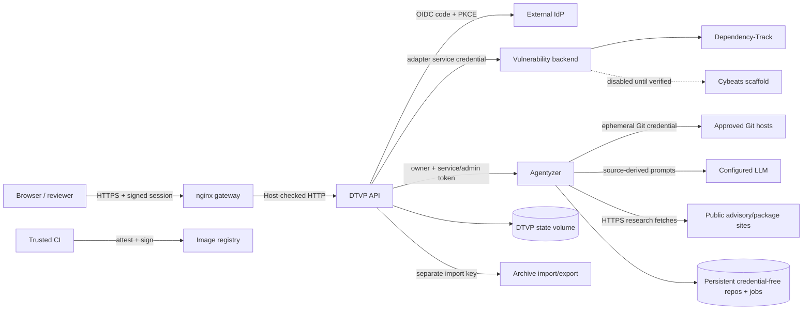

# DTVP Threat Model

Last reviewed: 2026-07-23

This document records DTVP's security boundaries, abuse cases, implemented
controls, and residual risks. The canonical curated context is in the
[project overview](project.md) and [architecture index](architecture/). Update
this model whenever a trust boundary, authentication flow, integration, durable
store, exposed route, or deployment topology changes.

## Scope And Security Objectives

The model covers the Vue frontend, nginx gateway, DTVP API, vulnerability-
backend adapters, Dependency-Track deployment, Agentyzer, local durable state,
archive workflows, CI, and published images. The external IdP, Git hosts, LLM
provider, public research sites, container host, and vulnerability-management
vendor are separate systems whose internal security is outside DTVP's control.
Their interfaces and the data DTVP sends to them are in scope.

The primary objectives are:

1. Only authenticated, authorized people can read or change vulnerability data.
2. Service credentials cannot be substituted for a more privileged identity or
   exposed to browsers, repositories, prompts, logs, or unrelated containers.
3. Assessments, archives, queues, and cached state preserve integrity across
   concurrency, retries, restarts, and backend changes.
4. Untrusted SBOMs, archives, repository content, advisories, and LLM output
   cannot escape their intended processing boundary.
5. Security-relevant activity remains attributable and recoverable.
6. A compromised component has the smallest practical network, filesystem, and
   credential blast radius.

Availability is important, but the current design favors one fail-closed API
process per DTVP state volume and one per Agentyzer repository volume. It does
not claim high availability or horizontally coordinated execution.

## System And Trust Boundaries



| Boundary | Untrusted or sensitive input crossing it | Principal used |
| :--- | :--- | :--- |
| Browser to nginx/DTVP | Cookies, headers, Markdown, filters, uploads, assessment changes | DTVP OIDC session |
| DTVP to IdP | Discovery/JWKS documents, authorization response, ID token | OIDC client and PKCE transaction |
| DTVP to vulnerability backend | Vendor JSON, paging, findings, SBOMs, assessment writes | Least-privilege review service credential |
| Archive workflow to backend | Uploaded archive and potentially project/BOM creation | Separate import service credential |
| DTVP to Agentyzer | Repository target, vulnerability context, guidance, owner identity | Normal service token; separate admin token for `*` scope |
| Agentyzer to Git/LLM/web | Source, credentials, model prompts/output, researched content | Per-repository Git secret and configured LLM/research policy |
| Processes to state volumes | Source, SBOMs, findings, queues, jobs, audits, archives | Non-root runtime UID and exclusive process lease |
| CI to registry | Source checkout, build context, signing key, image and attestations | Protected CI/registry/cosign credentials |

## Assets And Classification

| Asset | Sensitivity | Integrity/availability concern |
| :--- | :--- | :--- |
| Session, OIDC, backend, analyzer, Git, LLM, archive, database, and signing secrets | Critical | Theft permits impersonation, data change, code access, or release forgery |
| Private source and persistent Agentyzer clone objects | Confidential | Source may contain proprietary logic or accidentally committed secrets |
| SBOMs, findings, assessments, CVSS decisions, and team assignments | Confidential / high integrity | Incorrect data can hide exploitable vulnerabilities or create false work |
| Queues, saved results, proposals, caches, and archive snapshots | Internal / high integrity | Replay, loss, or cross-backend reuse can duplicate or misapply work |
| Audit events and backup markers | High integrity | Tampering can erase attribution or create false recovery confidence |
| Container images, SBOMs, provenance, and signatures | High integrity | Compromise propagates to every deployment |

Reviewers are trusted to perform global vulnerability operations. Analysts are
not trusted with reviewer controls or another team's assessment block. Service
operators and the container host are privileged and can ultimately access local
state; controls against them are detection and blast-radius measures, not a
hard tenant boundary.

## Security Invariants

- Browser credentials, cookies, and authorization headers are never forwarded
  to Dependency-Track, Agentyzer, tmrescore, or another backend.
- DTVP authenticates people through its OIDC provider. Dependency-Track is not
  used as DTVP's IdP, even if both applications share the same external IdP.
- Durable background work uses workload credentials, not a human user's
  Dependency-Track session or API key. This keeps work valid after logout and
  leaves authorization and human attribution at the DTVP boundary.
- Normal review and archive-import privileges use different backend
  credentials. Normal and service-wide Agentyzer scopes also use different
  tokens. Current and grace generations may never collide across those scopes.
- The selected vulnerability backend type and stable instance ID namespace all
  vendor-derived resource identities and local state. An unavailable adapter
  fails closed instead of borrowing another vendor's behavior.
- Assessment writes are re-authorized and reconciled against fresh backend
  state. Reviewer force overwrite is explicit; analysts cannot change shared or
  other-team fields.
- Repository credentials exist only in the child Git environment. Persisted
  remotes are scrubbed; retained clone objects and detached worktrees contain
  source but not the configured transport credential.
- Only one DTVP scheduler and one Agentyzer executor may operate on each local
  state volume. Multiple workers require an external coordinator.
- Security failures do not enable authentication bypasses, wildcard host
  access, cross-origin mutation, insecure TLS, or silent adapter fallback.

## Threat Analysis

| ID / STRIDE | Threat and impact | Implemented controls | Residual risk / required operation |
| :--- | :--- | :--- | :--- |
| T1 Spoofing | Stolen or forged browser session impersonates a reviewer. | OIDC authorization code with PKCE/state/nonce, issuer/JWKS/signature/claim checks, expiring signed cookies, Secure cookie in production, session-key rotation. | IdP compromise, endpoint malware, or XSS can still steal an active session. Keep IdP MFA and endpoint controls outside DTVP. |
| T2 Spoofing / elevation | Service token is reused as admin or a stale file becomes unsafe during rotation. | Separate service/admin tokens, minimum length, constant-time comparison, collision/duplicate rejection at startup and request time, temporary previous generations, authenticated owner scope. | Anyone holding the admin token can use `*`. Keep it only in DTVP/Agentyzer secret mounts and remove grace values promptly. |
| T3 Tampering | Analyst changes global, reviewer-only, stale, or another team's assessment. | Backend role enforcement, server-side reconstruction, fresh finding reconciliation, snapshot conflicts, explicit reviewer-only force replace, structured audit events. | A reviewer is intentionally powerful. Dependency-Track changes made outside DTVP may have different attribution and policy. |
| T4 Tampering | Cache or queue state from one vendor/tenant is applied to another. | Stable backend ID, backend-scoped paths and resource references, namespace marker validation, fail-closed adapter selection, durable queue/result state. | Changing an instance ID intentionally creates a new namespace; operators must migrate state explicitly if required. |
| T5 Repudiation | A user or operator denies a security-relevant change. | Actor/role/request/IP structured JSONL events, owner-only files, event hashes, bounded rotation, reviewer health reporting. | Local hashes are not a signed or chained ledger; a host administrator can rewrite the file. Forward events to immutable external retention. |
| T6 Information disclosure | Secrets leak through Compose, logs, Git remotes, API metadata, or browser traffic. | Hardened secret-file overlay, explicit environment allowlist, redaction, sanitized backend descriptors, credential-free Git remotes, child-only Git auth, no browser credential forwarding. | Base Compose permits direct values for compatibility and is not the production profile. Host/root access can read mounted secrets and state. |
| T7 Information disclosure / prompt injection | Malicious source, advisory, or web text manipulates the LLM into disclosing code or making an unsafe conclusion. | Conservative prompt contracts, deterministic claim audit, evidence requirements, bounded inputs, restricted research URL handling, configured repository map, human review before application. | Prompt injection cannot be eliminated. Treat all model output as untrusted; use a private/approved LLM because intended prompts contain source-derived data. |
| T8 SSRF | Repository metadata, tool calls, or integration URLs reach internal services or cloud metadata. | Production focus paths confined to the repository root, configured Git targets, HTTPS/public-address research validation, segmented networks, exact internal service URLs, normal TLS verification. | Operator-configured IdP/backend/LLM endpoints are trusted configuration. Enforce egress/DNS policy at the network layer against rebinding and newly reachable ranges. |
| T9 Tampering / denial | Malicious archive exploits path traversal, encryption, decompression, or huge member counts, then overwrites vendor data. | Reviewer authorization, dedicated import credential, pre-write path/member/size/ratio validation, bounded nginx and route bodies, preview/apply separation. | A structurally valid hostile SBOM can still consume backend resources or create misleading data; review previews and vendor quotas. |
| T10 Denial of service | Authenticated callers create unbounded scans, tasks, queries, or LLM inputs. | nginx limits, DTVP rate limits, bounded DTVP/Agentyzer queues, per-owner Agentyzer admission, concurrency semaphores, input/list/string limits, retention and record caps. | DTVP quotas are process-local and large legitimate projects remain expensive. Use production-shaped load tests and external rate controls. |
| T11 Denial / integrity | Multiple API workers race process-local schedulers and duplicate external work. | Owner-only non-following advisory lease file held for process lifetime; startup fails on contention; running work becomes interrupted after restart. | Advisory locking assumes a filesystem with reliable `flock`. Horizontal scale requires a shared queue, leases, and distributed rate limits. |
| T12 Information disclosure | Preserved workspaces expose private source after scans. | Credentials are scrubbed, per-run worktrees are isolated and pruned, containers are non-root, volumes are narrowly mounted, backup helper has no network. | Clone objects intentionally persist to speed repeated scans. Encrypt and restrict the repository/backup volume and define source-retention policy. |
| T13 Tampering / disclosure | XSS or unsafe Markdown changes UI behavior or extracts session data. | Vue escaping, shared DOMPurify allowlist, restrictive CSP and other browser headers, no environment-derived inline runtime script. | A sanitizer/browser/frontend dependency defect remains possible; keep npm audit and image scanning gates active. |
| T14 Denial / data loss | Disk exhaustion, SQLite corruption, stale backups, or unbounded audit logs make state unavailable. | Minimum-free-space and integrity health, readiness probes, owner-only SQLite/audit files, bounded audit rotation, durable queues, backup freshness marker, verified Compose backup workflow. | Backup encryption, off-host replication, scheduling, and restore tests are operator responsibilities. Readiness is not a substitute for restore testing. |
| T15 Supply-chain tampering | A dependency, action, builder, runner, or base image injects code into releases. | Lockfiles, immutable action/base/runtime image pins, minimal Alpine application images, a checksum-pinned Trivy binary, parity-tested GitHub/Forgejo workflows, dependency/Bandit/npm/Trivy gates, BuildKit SBOM/provenance, digest signing and immediate cosign verification. | A trusted runner or signing-key compromise can still produce a valid malicious artifact. Protect/rotate keys and isolate protected runners. |
| T16 Elevation / lateral movement | Compromised service pivots to databases, analyzers, other egress zones, or host. | Separate internal/outbound networks, dropped capabilities, read-only roots, non-root users, no-new-privileges, PID/log limits, narrowly writable mounts. | Docker daemon/host compromise defeats container boundaries. Apply host patching, runtime monitoring, and firewall policy. |

## Dependency-Track Identity Decision

The service-key approach is intentional. Dependency-Track API keys represent
teams and are suitable for workload authorization; Dependency-Track users are
not an identity provider for DTVP. Dependency-Track documents that
[API keys belong to teams and a team may have multiple keys](https://docs.dependencytrack.org/integrations/rest-api/),
which permits overlap-safe key rotation. Using a human API key or browser
session for background scans would couple jobs to one person's privileges,
employment, key rotation, and login lifetime. It would also blur which
application made the authorization decision.

Use a dedicated Dependency-Track team with only the portfolio/finding reads and
vulnerability-analysis writes needed by DTVP, plus Portfolio Access Control
where available. Use another team/key for archive project creation and BOM
upload. DTVP records the human initiator in its own audit boundary. If a future
backend supports OAuth client credentials, workload identity, or short-lived
service tokens, implement that in the adapter's credential provider; do not
forward the human DTVP session.

## Adding Another Vulnerability Backend

The current Cybeats entry is deliberately non-runnable. Enabling any new
backend requires all of the following before changing that status:

- an authenticated test tenant and a documented vendor API contract;
- a service-credential provider and least-privilege role matrix;
- typed resource identity, pagination, retry, timeout, error, and rate-limit
  behavior;
- explicit capability mapping for reads, assessment writes, archives, SBOMs,
  and any unsupported workflow;
- backend-instance cache/queue/archive/result isolation and marker tests;
- contract tests for malformed, partial, oversized, stale, and unauthorized
  vendor responses;
- audit redaction and safe non-secret adapter discovery metadata;
- a migration/rollback plan proving that selecting the adapter cannot write
  through Dependency-Track-shaped fallback code.

Until those conditions are met, fail-closed capability reporting is the
security control, not a missing feature to bypass.

## Residual Risk Register

| Risk | Priority | Treatment |
| :--- | :--- | :--- |
| LLM prompt injection and approved-provider source disclosure | High | Deploy only with an approved private/data-governed model; require human review and retain deterministic claim checks. |
| Dependency-Track review key has team-wide write scope | Medium-high | Minimize the team/PAC scope, rotate through vendor-side overlap, monitor DTVP and Dependency-Track audits. |
| Local audit file is mutable by host administrators | Medium-high | Forward to immutable authenticated storage and alert on health/write failures. |
| Persistent repository source and backups require at-rest protection | Medium-high | Encrypt volumes/backups, restrict host access, define retention, and test secure deletion independently. |
| Single-process coordination is an availability and scaling limit | Medium | Keep one worker per volume; design shared queue/leases/rate limits before horizontal scaling. |
| Authenticated large-project/model resource exhaustion | Medium | Tune admission/rate/retention limits and add workload-specific monitoring/load tests. |
| Cybeats/private vendor contract is unverified | Blocked feature | Keep adapter unavailable until the checklist above and a test tenant are provided. |
| Signing key or trusted CI runner compromise | Medium-high | Use protected isolated runners, restricted key access, rotation, transparency/registry monitoring, and independent verification. |

## Verification And Review Triggers

The normal verification baseline is:

```bash
uv run pytest
uv run bandit -ll -ii -c pyproject.toml -r dtvp agentyzer/src
uv run pip-audit --local --vulnerability-service=osv
cd frontend && npm run test:unit -- --run && npm run build && npm audit
```

Also validate every intended Compose overlay combination with `docker compose
config`, exercise `/livez`, `/readyz`, and authenticated health routes, run the
verified backup/restore procedure, and verify release image signatures by
digest.

Review this model for every new adapter, external service, exposed port,
credential or rotation mechanism, persisted data class, file upload, LLM tool,
authorization role, worker topology, CI publisher, or change to the deliberate
workspace-retention policy.
