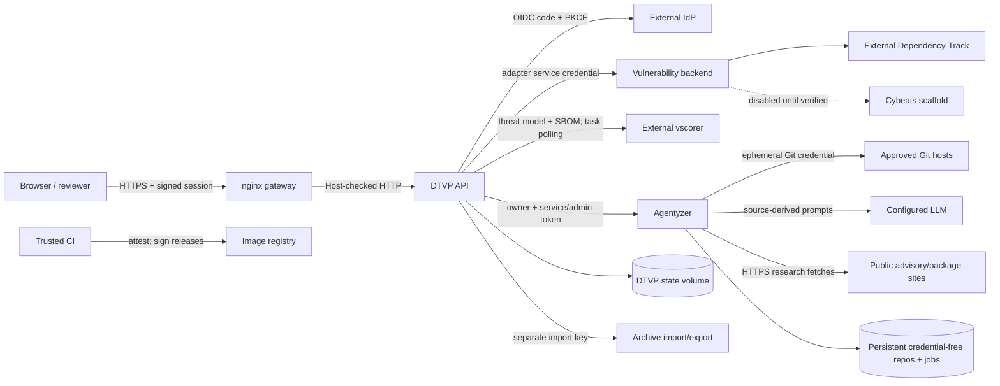

# DTVP Threat Model

Last reviewed: 2026-08-11

This document records DTVP's security boundaries, abuse cases, implemented
controls, and residual risks. The canonical curated context is in the
[project overview](project.md) and [architecture index](architecture/). Update
this model whenever a trust boundary, authentication flow, integration, durable
store, exposed route, or deployment topology changes.

## Scope And Security Objectives

The model covers the Vue frontend, nginx gateway, DTVP API, vulnerability-
backend adapters, Agentyzer, local durable state, archive workflows, CI, and
published images. The external IdP, Git hosts, LLM provider, public research
sites, container host, and vulnerability-management backends are separate
systems whose internal security and backup lifecycle are outside DTVP's
control. Their interfaces and the data DTVP sends to them are in scope. The
optional Dependency-Track demo is an explicitly non-production adapter
exercise environment, not part of the DTVP deployment boundary.
The optional Arcane topology publishes DTVP directly and delegates project
environment storage, image pulls, deployment control, and volume backup access
to the privileged Arcane operator boundary.

The primary objectives are:

1. Only authenticated, authorized people can read or change vulnerability data.
2. Service credentials cannot be substituted for a more privileged identity or
   exposed to browsers, repositories, prompts, logs, or unrelated containers.
3. Assessments, archives, queues, and cached state preserve integrity across
   concurrency, retries, restarts, and backend changes.
4. Untrusted SBOMs, archives, repository content, advisories, and LLM output
   cannot escape their intended processing boundary.
5. Security-relevant activity remains attributable and recoverable.
6. A compromised component has the smallest practical network, filesystem, and
   credential blast radius.

Availability is important, but the current design favors one fail-closed API
process per DTVP state volume and one per Agentyzer repository volume. It does
not claim high availability or horizontally coordinated execution.

## Security Principles

These principles are normative. A change that weakens one requires an explicit
threat-model update, compensating controls, a migration note, and focused tests.

1. **Fail closed at every trust boundary.** Missing authentication, unknown
   backends, invalid hosts/origins, unsafe production settings, unhealthy
   storage, and contended runtime leases stop the affected operation; they do
   not enable a permissive fallback.
2. **Authorize on the server and as late as practical.** The backend derives the
   actor and role, reloads current state before sensitive writes, and never
   treats hidden frontend controls or analyzer output as authorization.
3. **Use least privilege and separate principals.** Human sessions, normal
   backend review, archive import, Agentyzer owner scope, Agentyzer service-wide
   scope, Git access, LLM access, CI publishing, and host backup authority are
   distinct capabilities and must not share credentials.
4. **Do not create a confused deputy.** Browser cookies, bearer tokens, and
   authorization headers terminate at DTVP. Downstream work uses scoped
   workload identity while DTVP retains the human initiator for authorization
   and attribution.
5. **Treat every external artifact as hostile data.** Archives, SBOMs,
   repository files, vendor responses, advisories, Markdown, URLs, and LLM
   responses are validated, size-bounded, escaped or sanitized, and never
   interpreted as trusted instructions.
6. **Bound work before accepting it.** Request bodies, decompression, queues,
   per-owner jobs, concurrent calls, retained tasks/results, repository reads,
   model context, audit files, and logs have explicit limits and backpressure.
7. **Namespace durable state by security identity.** Vendor resources, caches,
   outboxes, queues, archives, proposals, and analyzer results are tied to a
   stable backend type and instance ID so one tenant or vendor cannot reuse
   another's state accidentally.
8. **Preserve integrity through concurrency and restart.** Fresh-state conflict
   checks, transactional SQLite stores, atomic file replacement, exclusive
   per-volume process leases, bounded retries, and explicit interrupted states
   protect assessments and background work.
9. **Minimize disclosure and persistence.** Secrets use file mounts in
   production, sensitive values are redacted, Git credentials are child-only,
   remotes are scrubbed, diagnostics are authenticated and non-cacheable, and
   retained source caches are credential-free and disposable.
10. **Reduce blast radius in every deployment.** Application processes run
    non-root with read-only roots, dropped capabilities, bounded PIDs, narrow
    writable mounts, and segmented networks. Privileged helpers are optional,
    isolated, and treated as host-administrator boundaries.
11. **Make security-relevant actions attributable and recoverable.** Structured
    audit events, storage/integrity health, durable queues, verified backups,
    restore procedures, and external retention provide evidence and recovery;
    health checks alone never count as a backup.
12. **Build reproducibly and promote evidence, not trust.** Exact lockfiles,
    immutable build inputs, restricted CI permissions, dependency/source/image
    scans, SBOMs, provenance, digest signing, and signature verification guard
    the release path.

## System And Trust Boundaries


```mermaid
flowchart LR
    Browser[Browser / reviewer] -->|HTTPS + signed session| Gateway[nginx gateway]
    Gateway -->|Host-checked HTTP| DTVP[DTVP API]
    DTVP -->|OIDC code + PKCE| IdP[External IdP]
    DTVP -->|adapter service credential| Backend[Vulnerability backend]
    DTVP -->|threat model + SBOM; task polling| Vscorer[External vscorer]
    Backend --> DT[External Dependency-Track]
    Backend -. disabled until verified .-> Cybeats[Cybeats scaffold]
    DTVP -->|owner + service/admin token| Analyzer[Agentyzer]
    Analyzer -->|ephemeral Git credential| Git[Approved Git hosts]
    Analyzer -->|source-derived prompts| LLM[Configured LLM]
    Analyzer -->|HTTPS research fetches| Web[Public advisory/package sites]
    DTVP --> State[(DTVP state volume)]
    Analyzer --> Repos[(Persistent credential-free repos + jobs)]
    DTVP -->|separate import key| Archive[Archive import/export]
    CI[Trusted CI] -->|attest; sign releases| Registry[Image registry]
```

| Boundary | Untrusted or sensitive input crossing it | Principal used |
| :--- | :--- | :--- |
| Browser to nginx/DTVP | Cookies, headers, Markdown, filters, uploads, assessment changes | DTVP OIDC session |
| DTVP to IdP | Discovery/JWKS documents, authorization response, ID token | OIDC client and PKCE transaction |
| DTVP to vulnerability backend | Vendor JSON, paging, findings, SBOMs, assessment writes | Least-privilege review service credential |
| DTVP to vscorer | Threat model, analysis SBOM, optional item/config inputs, task status, generated assessment | Configured HTTPS service endpoint; no browser credential forwarding |
| Archive workflow to backend | Uploaded archive and potentially project/BOM creation | Separate import service credential |
| DTVP to Agentyzer | Repository target, vulnerability context, guidance, owner identity | Normal service token; separate admin token for `*` scope |
| Agentyzer to Git/LLM/web | Source, credentials, model prompts/output, researched content | Per-repository Git secret and configured LLM/research policy |
| Processes to state volumes | Source, SBOMs, findings, queues, jobs, audits, archives | Non-root runtime UID and exclusive process lease |
| Optional backup scheduler to Docker Engine | Container discovery plus pause/resume operations | Docker socket; host-administrator-equivalent operator trust |
| CI to registry | Source checkout, build context, signing key, image and attestations | Protected CI/registry/cosign credentials |

### Executable OWASP pytm Analysis

`threatmodel/dtvp.py` is the model-as-code companion to this curated security
model. It covers DTVP, Agentyzer, their separate state volumes, the configured
LLM, Git and research access, the vulnerability backend, the IdP, and the
multipart/asynchronous vscorer flows. Run:

```sh
./scripts/generate-threat-model.sh
```

The command writes a Markdown findings report, serialized model JSON, and a
colorized Graphviz DFD source under `threat-model-results/`. CI runs the same
analysis and uploads those files. Model or template execution failures block
the workflow. Generated pytm findings are candidates for security review; they
do not automatically supersede the implemented-control decisions and residual
risk acceptances recorded below.

## Assets And Classification

| Asset | Sensitivity | Integrity/availability concern |
| :--- | :--- | :--- |
| Session, OIDC, backend, analyzer, Git, LLM, archive, signing secrets, and Docker Engine access | Critical | Theft permits impersonation, data change, code access, release forgery, or host takeover |
| Private source and disposable Agentyzer clone objects | Confidential | Source may contain proprietary logic or accidentally committed secrets; the cache may be destroyed and re-cloned |
| SBOMs, findings, assessments, CVSS decisions, and team assignments | Confidential / high integrity | Incorrect data can hide exploitable vulnerabilities or create false work |
| Queues, saved results, proposals, caches, and archive snapshots | Internal / high integrity | Replay, loss, or cross-backend reuse can duplicate or misapply work |
| Audit events and backup markers | High integrity | Tampering can erase attribution or create false recovery confidence |
| Container images, SBOMs, provenance, and signatures | High integrity | Compromise propagates to every deployment |

Reviewers are trusted to perform global vulnerability operations. Analysts are
not trusted with reviewer controls or another team's assessment block. Service
operators and the container host are privileged and can ultimately access local
state; controls against them are detection and blast-radius measures, not a
hard tenant boundary.

## Security Invariants

- Browser credentials, cookies, and authorization headers are never forwarded
  to Dependency-Track, Agentyzer, tmrescore, or another backend.
- DTVP authenticates people through its OIDC provider. Dependency-Track is not
  used as DTVP's IdP, even if both applications share the same external IdP.
- Durable background work uses workload credentials, not a human user's
  Dependency-Track session or API key. This keeps work valid after logout and
  leaves authorization and human attribution at the DTVP boundary.
- Normal review and archive-import privileges use different backend
  credentials. Normal and service-wide Agentyzer scopes also use different
  tokens. Current and grace generations may never collide across those scopes.
- The selected vulnerability backend type and stable instance ID namespace all
  vendor-derived resource identities and local state. An unavailable adapter
  fails closed instead of borrowing another vendor's behavior.
- Assessment writes are re-authorized and reconciled against fresh backend
  state. Reviewer force overwrite is explicit; analysts cannot change shared or
  other-team fields.
- Repository credentials exist only in the child Git environment. Persisted
  remotes are scrubbed; retained clone objects and detached worktrees contain
  source but not the configured transport credential.
- Only one DTVP scheduler and one Agentyzer executor may operate on each local
  state volume. Multiple workers require an external coordinator.
- Security failures do not enable authentication bypasses, wildcard host
  access, cross-origin mutation, insecure TLS, or silent adapter fallback.
- Arcane project configuration uses separate non-secret environment files per
  service and explicit Compose secret files. Arcane administrators and the
  Docker host remain privileged and can still read the source project
  environment.

## Guardrail Catalogue

The catalogue separates controls enforced by DTVP from responsibilities that
cannot be implemented inside the application boundary. Configuration names and
defaults are maintained in the [configuration reference](configuration.md).

| Area | Enforced guardrails | Operator obligations and deliberate limits |
| :--- | :--- | :--- |
| Human identity and sessions | OIDC authorization code flow uses state, nonce, PKCE, issuer/JWKS/signature/claim validation, asymmetric algorithm allowlisting, short-lived transactions, expiring signed `HttpOnly` cookies, production `Secure` cookies, and overlap-safe session-key rotation. The development bypass is rejected in production. | Require MFA and secure recovery at the IdP, use HTTPS end to end, register exact callbacks, generate a random key of at least 32 characters, and remove the previous key after the grace window—or immediately after suspected compromise. |
| Application authorization and write integrity | Backend dependencies derive the authenticated actor and role; reviewer-only and team-scoped operations are checked on every route. Assessment writes rebuild permitted fields, reconcile fresh backend state, detect snapshot conflicts, and make reviewer force replacement explicit. | Give reviewer roles sparingly, monitor both DTVP and vendor-side writes, and treat frontend visibility only as guidance. |
| Workload credentials and rotation | DTVP never forwards browser credentials. Normal backend review and archive import use separate keys; Agentyzer owner and `*` scopes use separate service/admin tokens. Files take precedence over direct values, token comparisons are constant-time, short/duplicate/colliding generations fail, and temporary previous generations are scope-preserving. | Create dedicated least-privilege vendor teams/roles, generate independent secrets, mount them with the production secret profile, rotate with bounded overlap, and keep Git, LLM, signing, registry, and Docker credentials outside unrelated services. |
| HTTP trust boundary | Production Host allowlists reject wildcards, unsafe methods require an allowed Origin, trusted proxy CIDRs bound forwarded-client-IP use, request IDs are syntax-limited, CORS is explicit, authentication/mutation/expensive-operation quotas are bounded, and nginx adds edge limits plus body and timeout controls. | Terminate TLS at a trusted gateway, configure exact public hosts/origins and only immediate proxy CIDRs, retain normal certificate verification, and add distributed edge quotas before horizontal scaling. |
| Browser and rendered content | CSP, HSTS in production, clickjacking/MIME/referrer/permissions/opener headers, Vue escaping, DOMPurify's allowlist, HTML-escaped SBOM rendering, no-store sensitive responses, and same-origin runtime configuration constrain browser execution and caching. | Keep TLS and frontend dependencies patched; treat sanitizer or browser compromise as residual risk and do not add inline/runtime-generated script without reviewing CSP. |
| Files, uploads, archives, and structured input | Settings and multipart bodies have route limits. Archive members are validated before extraction for normalized containment, type, encryption, count, per-member and total bytes, and compression ratio; 7z extraction receives only the validated member list. Import separates preview from reviewer-authorized apply. Pydantic and explicit string/list limits bound analyzer inputs. | Review structurally valid archive previews, keep vendor ingestion quotas, and never relax an outer proxy below the route's required upload size without preserving application limits. |
| Outbound integrations and SSRF | Provider endpoints are operator configuration; research fetches require HTTPS, public resolved addresses, restricted redirects and content, and bounded time/bytes. Research clones use a public-host allowlist and budgets. Internal and outbound Compose networks are separate, and browser credentials are not propagated. | Approve IdP/backend/vscorer/LLM/Git destinations, constrain DNS and egress to them, account for rebinding/new routes at the network layer, and install private CAs instead of disabling TLS. |
| LLM and source handling | Repository reads remain inside configured roots, reject links and non-regular files, and enforce per-file/aggregate limits. Git credentials exist only in child environments and persisted remotes are scrubbed. Prompts label source/web/model content as untrusted, deterministic claim checks require evidence, and generated assessments require human review. | Use an approved private or data-governed model, define source retention, restrict the repository volume, discard/re-clone it when required, and assume prompt injection remains possible. |
| Admission, availability, and retention | nginx and process-local rate limits, bounded executors/semaphores, DTVP and Agentyzer queue capacities, pre-wait per-owner admission, task TTLs, result/job record caps, bounded repository/model work, log rotation, and minimum-free-space checks prevent silent unbounded growth. | Tune limits with production-shaped load tests and monitoring. Large legitimate portfolios remain expensive; process-local quotas are not a distributed denial-of-service control. |
| Durable state, concurrency, and backend isolation | Atomic owner-only files, transactional SQLite migrations/stores, integrity checks, durable interrupted/retry states, backend-scoped paths and resource references, namespace markers, bounded cache writes, and one exclusive `flock` lease per DTVP/Agentyzer volume protect local integrity. Unsupported adapters remain unavailable. | Run exactly one DTVP process per state volume and one Agentyzer process per repository volume on filesystems with reliable locking. Design shared queues, leases, stores, and quotas before scaling out; migrate backend IDs explicitly. |
| Audit and diagnostics | Security events record actor, role, request, client IP, action, outcome, and event hashes in owner-only bounded JSONL files. Operational status is sanitized, authenticated, non-cacheable, and exposes detailed audit/storage/quota health only to reviewers. | Forward logs to authenticated immutable retention, alert on audit/storage/readiness failures, protect host clocks and log shipping, and recognize that a host administrator can rewrite local evidence. |
| Backup and recovery | The manual helper verifies an archive before marking success. The optional scheduler serializes runs, pauses DTVP for consistent state, has no network, and excludes the credential-free disposable repository cache. Backup freshness participates in readiness when configured. | Enable an appropriate backup mechanism, accept Docker-socket host authority only deliberately, encrypt and replicate off-host, define retention, back up the external vulnerability backend separately, and perform restore drills. Arcane snapshots require stopping the project and do not update DTVP's marker automatically. |
| Containers and networks | Packaged Compose uses non-root application processes, read-only roots, `no-new-privileges`, dropped capabilities, PID/tmpfs/log limits, narrow mounts, health-gated startup, and internal gateway/application/analysis networks with service-specific outbound bridges. Debug ports, archive import, Git export, demos, and the socket-bearing scheduler are opt-in. | Keep the Docker/Arcane host patched and access-controlled, set bind-mount ownership correctly, publish only the gateway or an intentional loopback endpoint, and never treat containers as a tenant boundary against a host administrator. |
| Build, CI, and release | Python/npm lockfiles, exact uv/tool versions, immutable third-party action and image references, restricted default CI permissions, same-repository PR publishing, provider-parity tests, Bandit/dependency/npm/Trivy gates, generated-contract/OKF/threat-model checks, SBOMs, provenance, PR-only tags, and cosign signing plus immediate verification protect promotion. | Protect trusted runners, registry and signing keys; review dependency updates and pins; verify deployed release signatures by digest; do not promote PR images as stable releases. |
| Deployment profiles and demos | Production startup rejects missing credentials, insecure callbacks/cookies, wildcard hosts, disabled auth, colliding tokens, unsupported adapters, and unsafe multi-process state. Dependency-Track and mock services live in an isolated demo boundary; Arcane keeps per-service non-secret files and explicit secret mounts. | Never use demo credentials/services as production infrastructure. Pin Arcane images by version or digest, restrict Arcane project/volume access, and review every enabled optional profile as a new trust boundary. |

## Threat Analysis

| ID / STRIDE | Threat and impact | Implemented controls | Residual risk / required operation |
| :--- | :--- | :--- | :--- |
| T1 Spoofing | Stolen or forged browser session impersonates a reviewer. | OIDC authorization code with PKCE/state/nonce, issuer/JWKS/signature/claim checks, expiring signed cookies, Secure cookie in production, session-key rotation. | IdP compromise, endpoint malware, or XSS can still steal an active session. Keep IdP MFA and endpoint controls outside DTVP. |
| T2 Spoofing / elevation | Service token is reused as admin or a stale file becomes unsafe during rotation. | Separate service/admin tokens, minimum length, constant-time comparison, collision/duplicate rejection at startup and request time, temporary previous generations, authenticated owner scope. | Anyone holding the admin token can use `*`. Keep it only in DTVP/Agentyzer secret mounts and remove grace values promptly. |
| T3 Tampering | Analyst changes global, reviewer-only, stale, or another team's assessment. | Backend role enforcement, server-side reconstruction, fresh finding reconciliation, snapshot conflicts, explicit reviewer-only force replace, structured audit events. | A reviewer is intentionally powerful. Dependency-Track changes made outside DTVP may have different attribution and policy. |
| T4 Tampering | Cache or queue state from one vendor/tenant is applied to another. | Stable backend ID, backend-scoped paths and resource references, namespace marker validation, fail-closed adapter selection, durable queue/result state. | Changing an instance ID intentionally creates a new namespace; operators must migrate state explicitly if required. |
| T5 Repudiation | A user or operator denies a security-relevant change. | Actor/role/request/IP structured JSONL events, owner-only files, event hashes, bounded rotation, reviewer health reporting. | Local hashes are not a signed or chained ledger; a host administrator can rewrite the file. Forward events to immutable external retention. |
| T6 Information disclosure | Secrets or operational diagnostics leak through Compose, logs, Git remotes, API metadata, or browser traffic. | Hardened secret-file overlay, explicit environment allowlist, redaction, sanitized backend descriptors, authenticated non-cacheable diagnostic status, reviewer-only audit/storage health, credential-free Git remotes, child-only Git auth, no browser credential forwarding. | Base Compose permits direct values for compatibility and is not the production profile. Host/root access can read mounted secrets and state. |
| T7 Information disclosure / prompt injection | Malicious source, advisory, or web text manipulates the LLM into disclosing code or making an unsafe conclusion. | Conservative prompt contracts, deterministic claim audit, evidence requirements, repository reads that reject links/non-regular files and enforce file/operation byte caps, restricted research URL handling, configured repository map, human review before application. | Prompt injection cannot be eliminated. Treat all model output as untrusted; use a private/approved LLM because intended prompts contain source-derived data. |
| T8 SSRF | Repository metadata, tool calls, or integration URLs reach internal services or cloud metadata. | Production focus paths confined to the repository root, configured Git targets, HTTPS/public-address research validation, segmented networks, exact internal service URLs, normal TLS verification. | Operator-configured IdP/backend/LLM endpoints are trusted configuration. Enforce egress/DNS policy at the network layer against rebinding and newly reachable ranges. |
| T9 Tampering / denial | Malicious archive exploits path traversal, encryption, decompression, or huge member counts, then overwrites vendor data. | Reviewer authorization, dedicated import credential, pre-write path/member/size/ratio validation, bounded nginx and route bodies, preview/apply separation. | A structurally valid hostile SBOM can still consume backend resources or create misleading data; review previews and vendor quotas. |
| T10 Denial of service | Authenticated callers, bogus cookie rotation, or hostile repository content create unbounded scans, waiting requests, tasks, queries, filesystem reads, or LLM inputs. | nginx limits, IP-bound authentication quotas, validated actor-plus-IP mutation quotas, dedicated expensive code-analysis route limits, bounded DTVP/Agentyzer queues, pre-wait per-owner inline admission, shared concurrency semaphores, input/list/string limits, non-following regular-file checks, per-file and aggregate repository-read limits, retention, and record caps. | DTVP quotas are process-local and large legitimate projects remain expensive. Use production-shaped load tests and external rate controls. |
| T11 Denial / integrity | Multiple API workers race process-local schedulers and duplicate external work. | Owner-only non-following advisory lease file held for process lifetime; startup fails on contention; running work becomes interrupted after restart. | Advisory locking assumes a filesystem with reliable `flock`. Horizontal scale requires a shared queue, leases, and distributed rate limits. |
| T12 Information disclosure | Preserved workspaces expose private source after scans. | Credentials are scrubbed, per-run worktrees are isolated and pruned, containers are non-root, volumes are narrowly mounted, backup helpers have no network, and the disposable repository volume is excluded from backups. | Clone objects intentionally persist to speed repeated scans. Restrict the repository volume, define source-retention policy, and discard/re-clone it when needed. |
| T13 Tampering / disclosure | XSS, unsafe Markdown, or hostile SBOM markup changes UI behavior or extracts session data. | Vue escaping, shared DOMPurify allowlist, HTML-escaped SBOM rendering, restrictive CSP and other browser headers, no environment-derived inline runtime script. | A sanitizer/browser/frontend dependency defect remains possible; keep npm audit and image scanning gates active. |
| T14 Denial / data loss | Disk exhaustion, SQLite corruption, stale backups, or unbounded audit logs make state unavailable. | Minimum-free-space and integrity health, readiness probes, owner-only SQLite/audit files, bounded audit rotation, durable queues, backup freshness marker, verified manual backup, and optional interval-based Compose scheduler with retry and overlap locking. | Enabling the scheduler, retention, encryption, off-host replication, external backend backup, monitoring, and restore tests remain operator responsibilities. Readiness is not a substitute for restore testing. |
| T15 Supply-chain tampering | A dependency, action, builder, runner, or base image injects code into releases. | Lockfiles, patched transitive test-tool overrides, omission of unused optional native XML tooling from SBOM generation, immutable action/base/runtime image pins, an exact shared uv version across CI and application images, minimal Alpine application images, a checksum-pinned Trivy binary, parity-tested GitHub/Forgejo workflows with provider-native pinned artifact actions, same-repository PR gating with PR-scoped image tags, dependency/Bandit/npm/Trivy gates, BuildKit SBOM/provenance, release digest signing and immediate cosign verification. | A trusted runner or signing-key compromise can still produce a valid malicious artifact. Protect/rotate keys and isolate protected runners. |
| T16 Elevation / lateral movement | Compromised service pivots to databases, analyzers, other egress zones, or host. | Separate internal/outbound networks, dropped capabilities, read-only roots, non-root users, no-new-privileges, PID/log limits, narrowly writable mounts; the socket-bearing scheduler is profile-gated, has no published port or external network, and runs only repository-owned backup code. | Docker socket access is host-administrator-equivalent and defeats container isolation if the scheduler is compromised. Keep the profile disabled unless that trust is accepted, use a dedicated patched host, and monitor Docker Engine operations. |
| T17 Tampering / disclosure | A malicious or compromised vscorer endpoint returns forged assessments, sustains polling, or retains uploaded threat models and SBOMs. | Exact operator-configured URL, normal TLS validation, bounded upload sizes, request timeouts, finite task retention, structured result validation, and no forwarding of browser credentials. | vscorer is an independently operated trusted integration that receives security design and inventory data. Approve its data handling, restrict network egress to the intended service, and require human review before applying generated assessments. |

## Dependency-Track Adapter Credential Decision

The service-key approach is intentional. Dependency-Track API keys represent
teams and are suitable for workload authorization; Dependency-Track users are
not an identity provider for DTVP, and its service is operated outside DTVP.
Dependency-Track documents that
[API keys belong to teams and a team may have multiple keys](https://docs.dependencytrack.org/integrations/rest-api/),
which permits overlap-safe key rotation. Using a human API key or browser
session for background scans would couple jobs to one person's privileges,
employment, key rotation, and login lifetime. It would also blur which
application made the authorization decision.

Use a dedicated Dependency-Track team with only the portfolio/finding reads and
vulnerability-analysis writes needed by DTVP, plus Portfolio Access Control
where available. Use another team/key for archive project creation and BOM
upload. DTVP records the human initiator in its own audit boundary. If a future
backend supports OAuth client credentials, workload identity, or short-lived
service tokens, implement that in the adapter's credential provider; do not
forward the human DTVP session.

## Adding Another Vulnerability Backend

The current Cybeats entry is deliberately non-runnable. Enabling any new
backend requires all of the following before changing that status:

- an authenticated test tenant and a documented vendor API contract;
- a service-credential provider and least-privilege role matrix;
- typed resource identity, pagination, retry, timeout, error, and rate-limit
  behavior;
- explicit capability mapping for reads, assessment writes, archives, SBOMs,
  and any unsupported workflow;
- backend-instance cache/queue/archive/result isolation and marker tests;
- contract tests for malformed, partial, oversized, stale, and unauthorized
  vendor responses;
- audit redaction and safe non-secret adapter discovery metadata;
- a migration/rollback plan proving that selecting the adapter cannot write
  through Dependency-Track-shaped fallback code.

Until those conditions are met, fail-closed capability reporting is the
security control, not a missing feature to bypass.

## Residual Risk Register

| Risk | Priority | Treatment |
| :--- | :--- | :--- |
| LLM prompt injection and approved-provider source disclosure | High | Deploy only with an approved private/data-governed model; require human review and retain deterministic claim checks. |
| Backend review credential may have vendor-wide write scope | Medium-high | Minimize vendor-side scope, rotate through supported overlap, and monitor both DTVP and backend audits. |
| Local audit file is mutable by host administrators | Medium-high | Forward to immutable authenticated storage and alert on health/write failures. |
| Arcane project environment and volume backups are operator-controlled | Medium-high | Restrict Arcane project/volume permissions, protect its data and backup mounts, stop DTVP before volume snapshots, and keep secrets out of Git. |
| Cached repository source and DTVP backups require separate protection | Medium-high | Restrict and securely discard the disposable repository cache; encrypt DTVP backups, define retention, and test secure deletion independently. |
| Optional backup scheduler holds Docker Engine authority | High when enabled | Keep the profile optional, restrict deployment/image modification, isolate and patch the Docker host, monitor Engine activity, or use an external host scheduler instead. |
| Single-process coordination is an availability and scaling limit | Medium | Keep one worker per volume; design shared queue/leases/rate limits before horizontal scaling. |
| Authenticated large-project/model resource exhaustion | Medium | Tune admission/rate/retention limits and add workload-specific monitoring/load tests. |
| Cybeats/private vendor contract is unverified | Blocked feature | Keep adapter unavailable until the checklist above and a test tenant are provided. |
| Signing key or trusted CI runner compromise | Medium-high | Use protected isolated runners, restricted key access, rotation, transparency/registry monitoring, and independent verification. |

## Verification And Review Triggers

The normal verification baseline is:

```bash
uv run pytest
uv run bandit -ll -ii -c pyproject.toml -r dtvp agentyzer/src
uv run pip-audit --local --vulnerability-service=osv
cd frontend && npm run test:unit -- --run && npm run build && npm audit
```

Also validate every intended Compose overlay combination with `docker compose
config`, exercise `/livez`, `/readyz`, and authenticated health routes, run the
verified backup/restore procedure, and verify release image signatures by
digest.

Review this model for every new adapter, external service, exposed port,
credential or rotation mechanism, persisted data class, file upload, LLM tool,
authorization role, worker topology, CI publisher, or change to the deliberate
workspace-retention policy.
