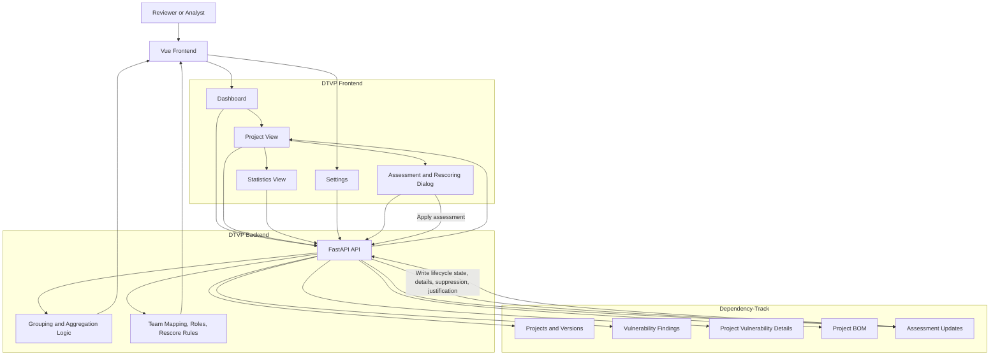
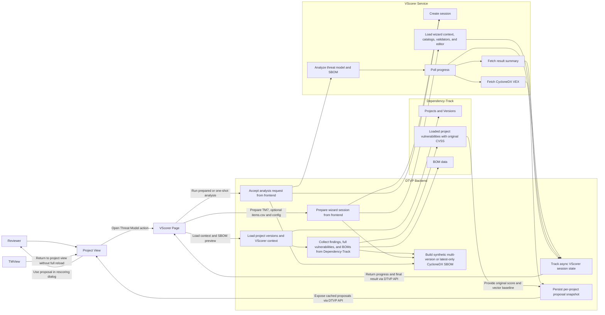

# DTVP Workflow Flowcharts

This document summarizes the overall DTVP workflow and the optional VScorer integration.

## 1. Core DTVP Workflow

```mermaid
flowchart TD
    User[Reviewer or Analyst] --> UI[Vue Frontend]

    subgraph Frontend["DTVP Frontend"]
        Dashboard[Dashboard]
        ProjectView[Project View]
        Statistics[Statistics View]
        Settings[Settings]
        RescoreDialog[Assessment and Rescoring Dialog]
    end

    UI --> Dashboard
    Dashboard --> ProjectView
    ProjectView --> Statistics
    ProjectView --> RescoreDialog
    UI --> Settings

    subgraph Backend["DTVP Backend"]
        API[FastAPI API]
        Grouping[Grouping and Aggregation Logic]
        Rules[Team Mapping, Roles, Rescore Rules]
    end

    subgraph DT["Dependency-Track"]
        Projects[Projects and Versions]
        Findings[Vulnerability Findings]
        FullVulns[Project Vulnerability Details]
        BOM[Project BOM]
        Updates[Assessment Updates]
    end

    Dashboard --> API
    ProjectView --> API
    Statistics --> API
    Settings --> API
    RescoreDialog --> API

    API --> Projects
    API --> Findings
    API --> FullVulns
    API --> BOM
    API --> Updates

    API --> Grouping
    API --> Rules
    Grouping --> UI
    Rules --> UI

    RescoreDialog -->|Apply assessment| API
    API -->|Write lifecycle state, details, suppression, justification| Updates
    Updates --> API
    API --> ProjectView
```

## 2. DTVP and VScorer Integration Workflow

```mermaid
flowchart LR
    User[Reviewer] --> ProjectView[Project View]
    ProjectView -->|Open Threat Model action| VSView[VScorer Page]

    subgraph DTVP["DTVP Backend"]
        Context[Load project versions and VScorer context]
        Inventory[Collect findings, full vulnerabilities, and BOMs from Dependency-Track]
        SyntheticSBOM[Build synthetic multi-version or latest-only CycloneDX SBOM]
        PrepareWizard[Prepare wizard session from frontend]
        AnalyzeRequest[Accept analysis request from frontend]
        SessionCache[Track async VScorer session state]
        ProposalCache[Persist per-project proposal snapshot]
    end

    subgraph DT["Dependency-Track"]
        DTProjects[Projects and Versions]
        DTVulns[Loaded project vulnerabilities with original CVSS]
        DTBOMs[BOM data]
    end

    subgraph VS["VScorer Service"]
        Session[Create session]
        WizardContext[Load wizard context, catalogs, validators, and editor]
        Analyze[Analyze threat model and SBOM]
        Progress[Poll progress]
        Results[Fetch result summary]
        VEX[Fetch CycloneDX VEX]
    end

    VSView -->|Load context and SBOM preview| Context
    VSView -->|Prepare TM7, optional items.csv and config| PrepareWizard
    VSView -->|Run prepared or one-shot analysis| AnalyzeRequest
    Context --> DTProjects
    Context --> Inventory
    Inventory --> DTVulns
    Inventory --> DTBOMs
    Inventory --> SyntheticSBOM

    PrepareWizard --> SyntheticSBOM
    PrepareWizard --> Session
    PrepareWizard --> WizardContext
    WizardContext --> SessionCache
    AnalyzeRequest --> SyntheticSBOM
    AnalyzeRequest --> Session
    AnalyzeRequest --> Analyze
    Analyze --> Progress
    Progress --> SessionCache

    Progress --> Results
    Results --> SessionCache

    Progress --> VEX
    VEX --> ProposalCache
    DTVulns -->|Provide original score and vector baseline| ProposalCache

    SessionCache -->|Return progress and final result via DTVP API| VSView
    ProposalCache -->|Expose cached proposals via DTVP API| ProjectView

    ProjectView -->|Use proposal in rescoring dialog| User
    TMView -->|Return to project view without full reload| ProjectView
```
